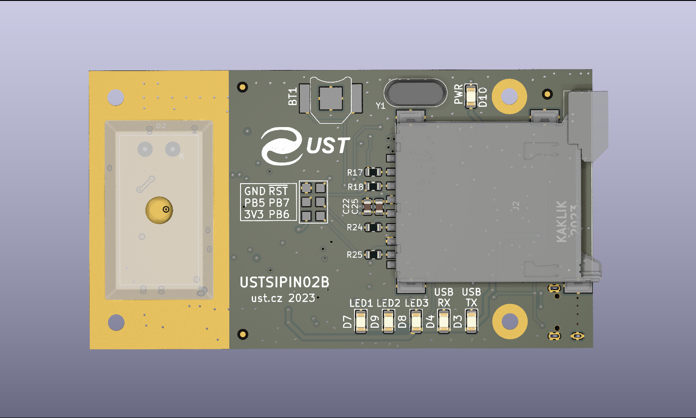

## AIRDOS03 - UAS Radiation Dosimeter and Spectrometer

The AIRDOS03, also known as "UAVDOS," is a compact ionizing radiation detector and spectrometer developed in collaboration with [Universal Scientific Technologies s.r.o.](https://www.ust.cz) and optimized for integration with unmanned aerial vehicles (UAVs). It is based on the proven USTSIPIN02 electronics and is tailored for use in airborne radiation research missions.

### UAV Integration

AIRDOS03 is designed as a sensor for the [TF-ATMON](/instruments/TF-ATMON) system and seamlessly connects to the avionics of UAVs, especially the [ThunderFly TF-G2 autogyro](/instruments/TF-G2). It supports shared power supply, data logging, and telemetry with onboard systems, reducing weight and maximizing flight endurance.

This integration enables high-resolution mapping of radiation intensity in three dimensions and supports dynamic measurements in variable atmospheric conditions.

### Core Technology

At the heart of AIRDOS03 is the USTSIPIN02 silicon PIN diode-based detection system, which enables:

* Measurement of the deposited energy of ionizing radiation in the 40 keV to 80 MeV
* Energy resolution 15 ±2 keV per channel (firmware-dependent)
* Effective number of energy channels: ~65000
* 44 mm³ detection volume
* Radiation spectra integration time: 10 s (configurable by firmware)
* Environmental sensors
  * Relative Humidity 0 to 100 %RH (accuracy 2	%RH)
  * Temperature -40 to 125 °C (accuracy 0.5 °C)
* Lightweight, compact electronics
  * 91 × 51 × 20 mm
  * 40 grams
* Interface options: UART (JST-GH - Pixhawk-compatible)
  * UART could be converted to USB-C by [TFUSBSERIAL01](/avionics/TFUSBSERIAL01/)
  * Device suitable for real-time spectrum measurement and in-flight data logging.

### Key Features

* Fully compatible with [TF-ATMON](/instruments/TF-ATMON) and Pixhawk ecosystem
* Lightweight and low-power (5 V / 3 mA)
* Spectral data output for scientific analysis
* Can operate in real-time streaming mode or store data onboard
* Modular open-source firmware for custom scientific missions

### Connector Pinout

AIRDOS03 provides TELEM/UART connectivity. The UART interface is compatible with the [Pixhawk connector standard](https://github.com/pixhawk/Pixhawk-Standards/blob/master/DS-009%20Pixhawk%20Connector%20Standard.pdf) and enables integration with onboard telemetry systems or flight controllers.

#### UART (JST-GH) Pinout

| Signal | Pixhawk Color                            | ThunderFly Color                                              |
| ------ | ------------------------------------------------- | ---------------------------------------------- |
| +5V    |  Red     |  Red       |
| RX     |  Black |  White   |
| TX     |  Black |  Green   |
| CTS    |  Black |  Blue     |
| RTS    |  Black |  Yellow |
| GND    |  Black |  Black   |

#### Auxiliary IO (JST-GH)

These signals provide additional functions, including synchronization or inter-device communication. This connector is primarily intended for time synchronization with the [TFGPS01 GNSS module](/avionics/TFGPS01), which provides PPS and time pulse signals on "Payload Connector".

| Signal    | Pixhawk Color                | ThunderFly Color                                  |
| --------- | ------------------------------------------------------- | ----------------------------------------------------------------------------------- |
| TIMEPULSE |  Black |  Blue     |
| EXTINT    |  Black |  Yellow |
| GPIO |  Black |  White   |
| SDA       |  Black |  Green   |
| SCL       |  Black |  Yellow |
| TX        |  Black |  White   |
| RX        |  Black |  Green   |
| GND       |  Black |  Black   |

### Use Cases

* UAV-based atmospheric radiation surveys
* Detection of increased ionizing radiation in convective storm regions
* Mapping radiation gradients near ground-based or airborne sources
* Scientific support for space weather and high-altitude dosimetry research

### Where to get it?

AIRDOS03 can be purchased directly from ThunderFly via our [contact page](https://www.thunderfly.cz/contact-us.html). For larger orders or special configurations, feel free to reach out with your requirements.

Although AIRDOS03 was developed in partnership with [Universal Scientific Technologies s.r.o.](https://www.ust.cz), the ThunderFly team handles sales, support, and integration for airborne applications.

