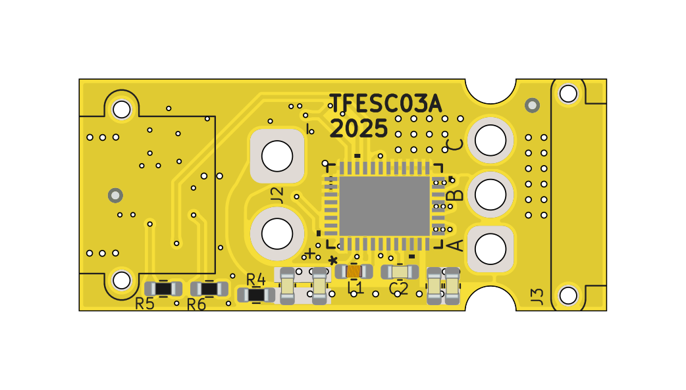
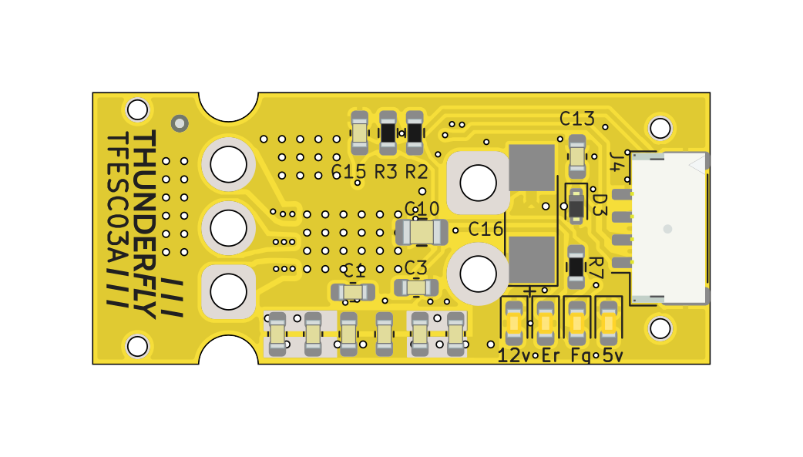
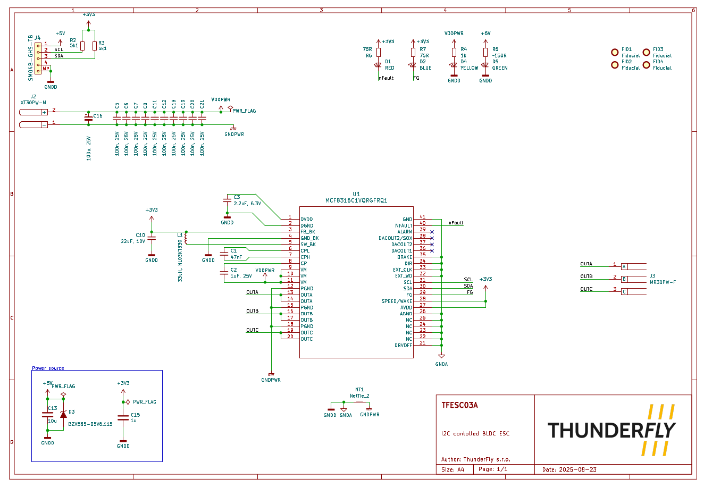

# TFESC03 - Miniature BLDC Motor Driver with I2C Interface

The TFESC03 is a compact, high-performance BLDC motor driver designed for UAVs and other embedded systems where space and efficiency are critical. It is based on the [MCF8316C-Q1](https://www.ti.com/product/MCF8316C-Q1) integrated circuit, enabling **sensorless Field Oriented Control (FOC)**. TFESC03 integrates directly into UAV avionics through a PixHawk I2C interface and is fully compatible with PX4 autopilot firmware.

## Features

  * Sensorless FOC with built-in MOSFETs (95 mΩ typ. RDS(on)).
  * Supports 3-phase BLDC and PMSM motors up to 8 A peak.
  * Built-in EEPROM for non-volatile configuration.
  * Wide input range: 4.5 V to 35 V (40 V abs max).
    * Integrated buck regulator (3.3 V / 5 V, from I2C peripheral power supply).
  * Primary: I2C (100 kHz).
  * Alternative: PWM, analog voltage, or frequency-based control.
  * nFAULT and ALARM LEDs for system diagnostics.
  * Integrated FG pin for speed feedback.
  * UVLO (under-voltage lockout), OVP (over-voltage protection).
  * OCP (over-current protection), thermal shutdown.
  * Motor lock detection and fault indication.

## Technical Specifications

* **Input Voltage Range**: 4.5 – 35 V (40 V abs max)
* **Peak Current**: 8 A
* **Control Interfaces**: I2C (primary), PWM, Analog, Frequency
* **Integrated Regulators**: 3.3 V / 5 V buck (170 mA), 3.3 V LDO (20 mA)
* **Operating Temperature**: –40°C to +125°C
* **Dimensions**: 34.0x15.0 mm Compact PCB, optimized for UAV integration

## Connectors

* **J2**: XT30PW-M (Power input)
* **J3**: MR30PW-F (3-phase motor output)
* **J4**: SM04B-GHS-TB (JST-GH PixHawk standard I2C interface)

## Integration with UAV Systems

The TFESC03 provides seamless integration into UAV avionics through its I2C interface. It allows precise speed control, torque optimization, and diagnostics directly from autopilot systems such as PX4 parameters. Its efficiency and compact size make it suitable for propulsion systems in micro and small UAVs, as well as robotic and industrial automation applications.

### Improved Energy Efficiency

The advanced FOC algorithm and integrated regulators minimize power losses while maximizing torque efficiency and extending runtime. Built-in soft-start/stop and dead-time compensation improve acoustic performance and extend motor winding lifetime.

### Applications

* UAV propulsion systems
* Robotics and automation end-effectors
* Compact pumps, fans, and blowers
* Remote-controlled propulsion modules

## Availability

The TFESC03 is available from [ThunderFly s.r.o.](https://www.thunderfly.cz/).

* For commercial inquiries, contact: [sale@thunderfly.cz](mailto:sale@thunderfly.cz)
* Customization or mounting modifications are available upon request.

