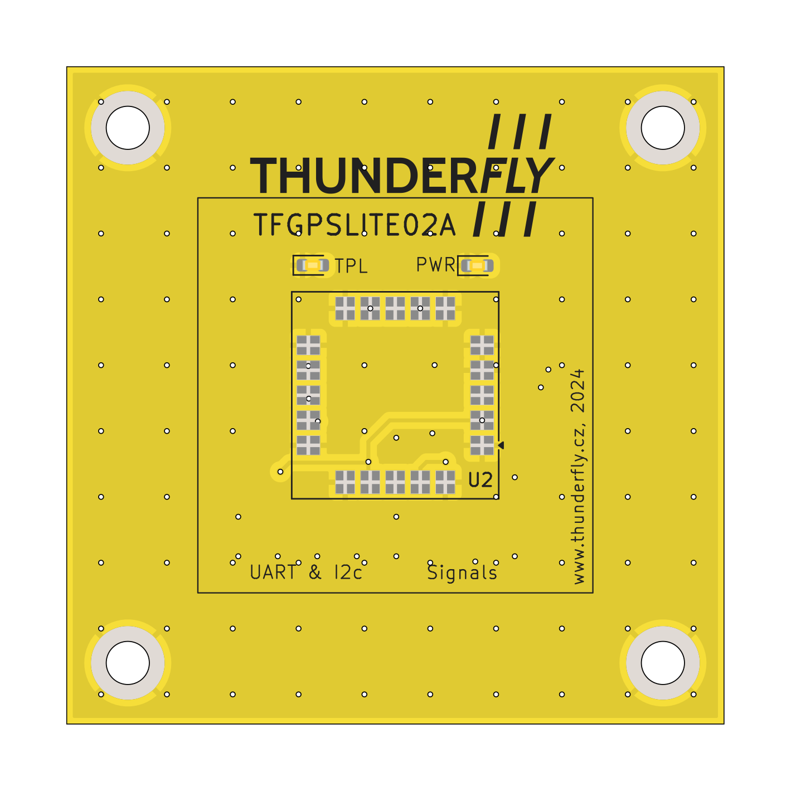
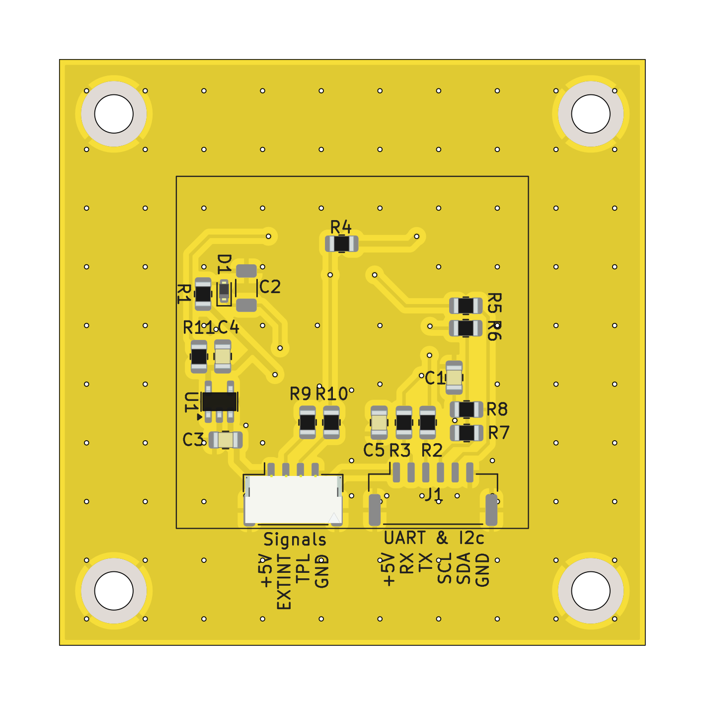

# TFGPSLITE02 - Compact GNSS Module for Lightweight UAVs

The **TFGPSLITE02** is a compact and high-performance GNSS module designed for small, lightweight UAVs. Featuring the u-blox SAM-M8Q chipset, it provides reliable and accurate navigation by supporting multiple satellite constellations. This module integrates seamlessly with flight controllers via the Pixhawk standard "Basic GPS Port."

  

## Key Features

- **Multi-GNSS Support**: Concurrent reception of GPS, Galileo, and GLONASS.
- **Compact Form Factor**: 15.5 x 15.5 x 6.3 mm with an integrated patch antenna.
- **Enhanced Performance**: Designed for weak signal environments.
- **Advanced Security**:
  - Geofencing capabilities.
  - Spoofing detection for signal integrity.
  - Message integrity protection.
- **Operational Range**:
  - Maximum altitude: 50,000 m.
  - Maximum velocity: 500 m/s.
- **Low Power**: Optimized for efficient energy use.

## Technical Specifications

### Electrical Characteristics
- **Input Voltage**: 5 V.
- **Power Consumption**: Typical 30 mA.

### GNSS Performance
- **Cold Start Time-to-First-Fix (TTFF)**: 26 seconds.
- **Hot Start TTFF**: 1 second.
- **Position Accuracy**: 2.5 m CEP.

### Environmental Tolerance
- **Operating Temperature**: -40 °C to 85 °C.
- **Storage Temperature**: -40 °C to 85 °C.

### Interfaces
- UART and I2C through the Pixhawk Basic GPS Port.
- Configurable time pulse output (1 PPS).

## Connection Details

The **TFGPSLITE02** uses the Pixhawk "Basic GPS Port" for integration with flight controllers. The port pinout is as follows:

| Pin | Signal    | Voltage |
|-----|-----------|---------|
| 1   | VCC       | +5V     |
| 2   | TX (OUT)  | +3.3V   |
| 3   | RX (IN)   | +3.3V   |
| 4   | I2C SCL   | +3.3V   |
| 5   | I2C SDA   | +3.3V   |
| 6   | GND       | GND     |

## Application Areas

- Lightweight UAV navigation.
- Applications requiring compact and efficient GNSS solutions.
- Environments with limited power supply.

## Integration Guidelines

1. Connect the module to the flight controller via the Basic GPS Port.
2. Configure the UART interface for 9600 baud communication.
3. For improved accuracy, enable supported augmentation systems like SBAS or QZSS.

