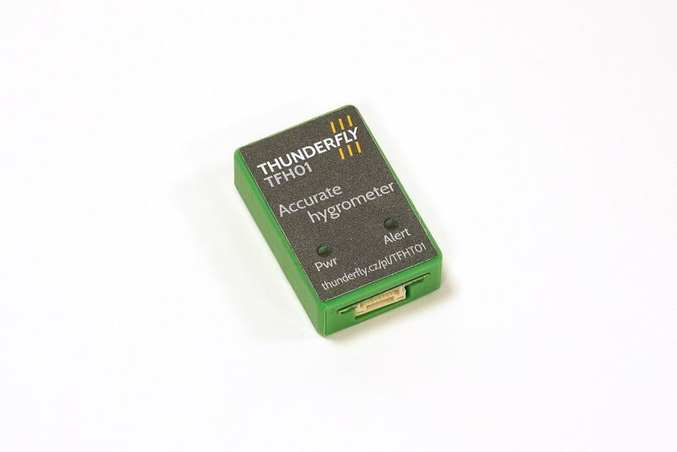

# TFHT01 - UAV Humidity and Temperature Sensor

The [TFHT01](https://github.com/ThunderFly-aerospace/TFHT01) hygrometer (humidity and temperature) sensor can be directly connected to a Pixhawk autopilot with PX4 firmware, or it can be used as a sensor for the [TF-ATMON monitoring system](https://www.thunderfly.cz/tf-atmon.html).

Sensors mounted on UAVs can be used for a variety of purposes. TFHT can measure air temperature and humidity, which can be used for meteorological purposes to estimate whether icing may form on aerodynamic surfaces. It could also be used to determine if the flight is conducted within the operating range of the drone. Another use can be to measure the temperature of selected UAV components, for example, the temperature of batteries, ESC, motor, or some bearings.



## How to Buy

- Direct order — Email [sale@thunderfly.cz](mailto:sale@thunderfly.cz) for quotations, customization requests, or volume purchases handled by ThunderFly s.r.o.
- [Purchase TFHT01 on Lectronz](https://lectronz.com/products/1064) for EU-based fulfillment.
- [Purchase TFHT01 on Tindie](https://www.tindie.com/products/thunderfly/tfht01-aerial-hygrometer-and-thermometer/) for worldwide shipping.

## Parameters

| Parameter | Value | Description |
|-----------|-------|-------------|
| Sensing element | [SHT35](https://sensirion.com/media/documents/213E6A3B/63A5A569/Datasheet_SHT3x_DIS.pdf) | Other possible sensors are SHT30 or SHT31 |
| Typical accuracy | 1.5 %RH and 0.1 °C | |
| Repeatability | 0.15 %RH , 0.08 °C | The stated repeatability is 3 times the standard deviation (3σ) of multiple consecutive measurements at constant ambient conditions. |
| Operating temperature range| 0 °C - +65 °C | Sensor physically measures in range -40°C to +120°C with reduced accuracy |
| Operating humidity range| 0-100 % | At humidity above 80% the performance of the sensor could be degraded in case of prolonged periods |
| I2C connector | 4-pin JST-GH | The second connector could be installed on the opposite side |
| I2C address | 0x44 default | By switching of JP1 is possible change address to 0x45 |
| Storage temperature range| -20 °C - +40 °C |  |
| Operational input voltage | 3.6 - 5.4V | Overvoltage internally protected by zener diode |
| Mass | 2 g | PCB without cabling |
| Dimensions | 30 x 15 x 6.5 mm |  PCB |
| Weather resistance | IP40 | External connectors fully occupied. The sensor itself could be protected by IP67 according the [sensirion datasheet](https://sensirion.com/media/documents/9D103E42/61641F0F/Sensirion_Humidity_Sensors_SHT3x_Datasheet_Filter_Membrane.pdf) |


## Plastic case
To minimize heat transfer via copper, the PCB has a minimal amount of copper surfaces and is made on a very thin PCB, which is sensitive to mechanical stress. Therefore, we have developed a casing for the sensor that ensures high mechanical durability of the entire solution.


### Disassembly
In case you need to remove the sensor from the casing (which is not recommended), the procedure is simple. Unscrew the two screws from the casing, then gently press a flat object against the exposed edge of the PCB (near the sensor itself) and carefully slide the sensor out of the casing towards the connector.

### Assembly
The assembly process is very simple. Take the sensor's PCB and carefully insert it into the slot near the connector in the casing. Apply a steady, moderate pressure to slide it all the way into the casing.
Then, secure it to the casing with two screws.

### Mounting options
Due to its small size and lightweight design, attaching the sensor to a drone is very easy. You can use methods such as Velcro, zip ties, or double-sided adhesive tape.

## Applications

### Atmospheric sounding

The TFHT01 sensor could be used for [direct atmospheric sounding](https://en.wikipedia.org/wiki/Atmospheric_sounding). Here is an example of measured data taken by [TF-G2 autogyro](https://www.thunderfly.cz/tf-g2.html).


## Design


### Schematics

[](https://github.com/ThunderFly-aerospace/TFHT01/blob/TFHT01B/doc/gen/TFHT01-schematic.pdf)


## Connection to Autopilot:
Connecting to a Pixhawk-compatible autopilot is very simple. The TFHT sensor can be directly connected to the autopilot using the provided 4-pin JST-GH cable, plugging it into the I2C port on the autopilot.

After connecting to the autopilot and powering it on, a green LED on the sensor should light up, indicating the availability of power.

## Usage in PX4 autopilot firmware

The [PX4 autopilot](https://github.com/PX4/PX4-Autopilot) firmware supports the sensor. Multiple sensors can be connected to one autopilot. The measured data are immediately sent to the ground station and they are also logged in the onboard ulog file. Sensor support can be enabled by setting the [SENS_EN_SHT3X](http://docs.px4.io/master/en/advanced_config/parameter_reference.html#SENS_EN_SHT3X) parameter to 1.


### Driver Commands Examples

CLI usage example:

    sht3x start -X

Start the sensor driver on the external bus

    sht3x status

Print driver status

    sht3x values

Print the last measured values

    sht3x reset

Reinitialize senzor, reset flags

### PX4 Driver Usage

```
sht3x <command> [arguments...]
 Commands:
   start
     [-I]        Internal I2C bus(es)
     [-X]        External I2C bus(es)
     [-b <val>]  board-specific bus (default=all) (external SPI: n-th bus
                 (default=1))
     [-f <val>]  bus frequency in kHz
     [-q]        quiet startup (no message if no device found)
     [-a <val>]  I2C address
                 default: 68
     [-k]        If initialization (probing) fails, keep retrying periodically

   stop

   status        print status info

   values        Print actual data

   reset         Reinitialize sensor
```

## Usage in Ardupilot firmware

In the Ardupilot firmware, the corresponding sht3x driver for TFHT01 is currently missing. The contributions are welcomed.

## FAQ

### I am not able to find the SENS_EN_SHT3X parameter in QGC

Unfortunately, the PX4 developers have disabled the compilation of the TFHT01 sensor driver in the default release versions of the firmware due to memory constraints of the autopilot hardware. To compile the driver, you must modify the Kconfig configuration using the boardconfig tool (make px4_fmu-v5_default boardconfig).
Please follow the instructions on [PX4 menuconfig setup](https://docs.px4.io/main/en/hardware/porting_guide_config.html#px4-menuconfig-setup) In the configuration tree, locate ```Drivers -> Hygrometers``` and enable ```HYGROMETER SHT3x```.
After setting up the firmware with these changes, compile it and upload it to your autopilot. Then you should see the SENS_EN_SHT3x parameter.


## Product evolution
### 2024/05
Production of new batch of TFHT01B. The sensors are now enclosed in a plastic casing, offering enhanced mechanical durability.

### 2023/09
Modifications have been made to improve the sensor's sensing capabilities. By using a thinner PCB and eliminating its thermal conductivity, the sensor now has a faster response to environmental changes. The sensor is now equipped with an SHT35 sensor.

### 2023
The first batch of TFHT01A sensors has been manufactured.
