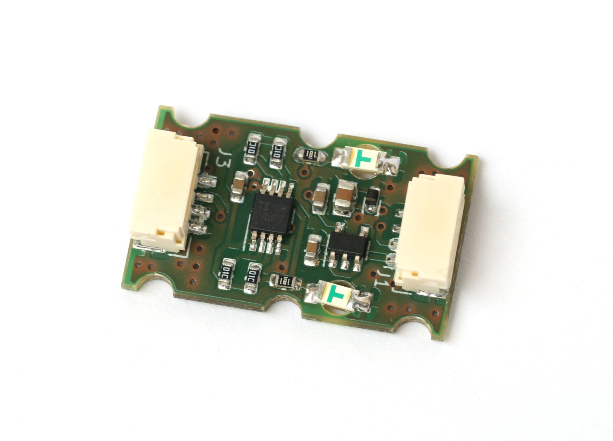
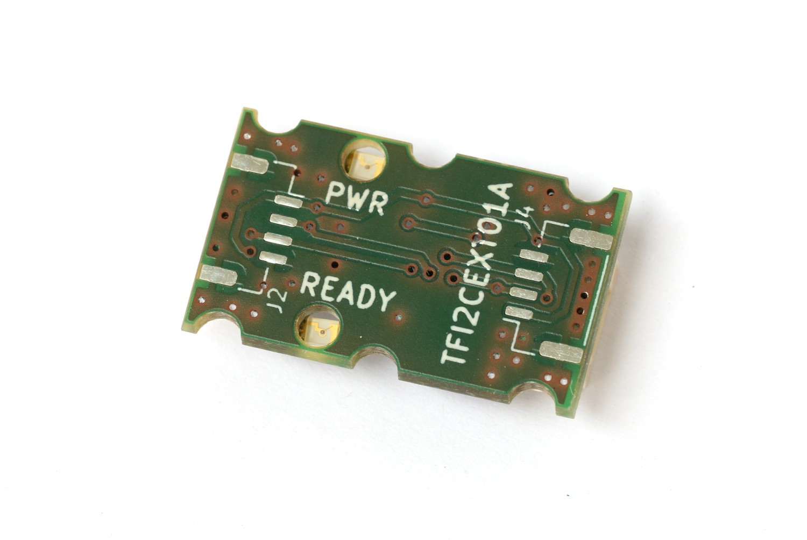

# TFI2CEXT01 - I²C Bus Extender Documentation

The TFI2CEXT01 is an I²C bus extension module designed to extend the possible total length of the I²C bus on UAV's and drones. The module does not contain any configuration or modifiable firmware. Therefore, this module does not require any setup and can be connected to any I2C bus.

## Availability
The TFI2CEXT01 I²C bus extender is commercially available from ThunderFly s.r.o. For purchasing, you can:
- Email: [info@thunderfly.cz](mailto:info@thunderfly.cz)
- Purchase online: [Tindie](https://www.tindie.com/products/26352/)

## Parameters

| Parameter                        | Value             | Description                                                  |
|----------------------------------|-------------------|--------------------------------------------------------------|
| Data rate                        | Up to 400 kHz     | Defined by used TCA4307 IC                                   |
| I²C Connector                    | 2x 4-pin JST-GH   | Connected in parallel, it is possible to exted to 4 JST-GH connectors |
| Operating and storage temperature| -20°C to +40°C    | Limited by case material                                     |
| Operational input voltage        | 3.6V to 5.4V      | Pixhawk standard compatibile                                 |
| Mass                             | ~2 g              | PCB                                                          |
| Dimensions                       | 15x25x6(10.5) mm  | One-sided connectors (10.5 mm with connector on both sides)  |
| Weather resistance               | IP30              |                                                              |

## Features
- **Input Power Status LED Indicator**
- **Optional Pass-Through I²C Connectors**: Allows daisy chaining of different sensors.
- **Bus Segment Isolation**: Can disconnect stacked devices.
- **Differentiated Handling of Master and Slave Bus Sides**
- **Device Reset Capability**: Can reset frozen devices.
- **READY Signal Indication**: Shows correct connection of both I²C bus sides.

The two I²C Pixhawk connectors on the bottom and top are directly connected, facilitating easy integration with other I²C devices on existing bus cabling.

## Device Reset Functionality
The TCA4307 features stuck bus recovery, automatically disconnecting the slave side of the bus from the master if it detects either SDAOUT or SCLOUT low for approximately 40 ms. Once disconnected, the device generates up to 16 pulses on SCLOUT to attempt to reset any device holding the bus low.

## Usage
Optimal performance is achieved when the TFI2CEXT01A is positioned in the middle of the length between the master and slave devices. This positioning ensures effective active signal amplification for both signaling directions. However, in real-world applications, I²C devices have varying driving capabilities, and I²C signals are often affected by capacitive load or unwanted signal coupling. The TFI2CEXT01A can isolate signals in bus segments, making it ideal for connecting to "problematic" I²C devices closer to the module.

## Connection Instructions
Special attention is required for proper connection due to the device reset capability of the TFI2CEXT01A. The connector closer to the LEDs should be connected to the Master device (e.g., autopilot). The opposite connector, farther from the LEDs, should be connected to I²C slaves, such as sensors.

# Current version

**TFI2CEXT01A**: Current version is TFI2CEXT01A
