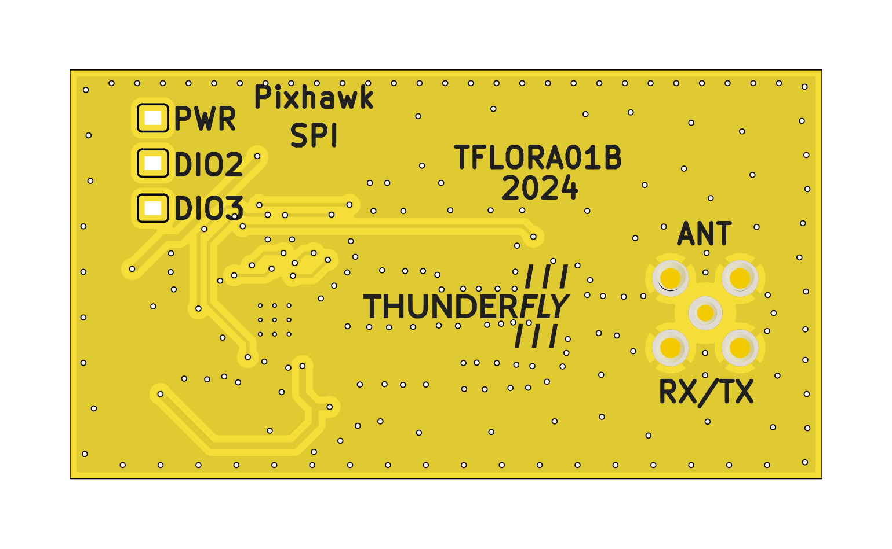
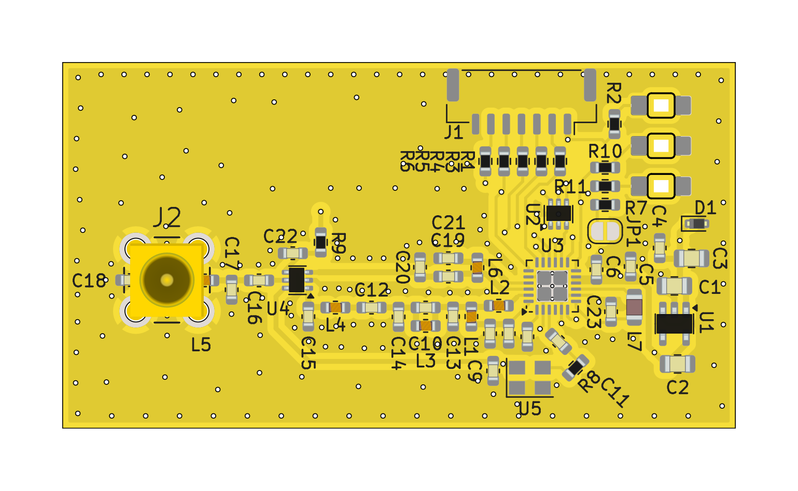

# TFLORA01 - UAV LoRa and FSK Transceiver

The TFLORA01 device is designed for long-range telemetry transmission from UAVs using LoRa technology. It operates in the sub-GHz frequency band and is based on the Semtech SX1262 transceiver, which supports LoRa and (G)FSK modulation for various telemetry and IoT applications.

This module does not contain any onboard firmware, providing greater flexibility for custom implementations. Firmware for communication protocols such as MAVLink is provided by out-of-tree driver in the PX4 autopilot system. The absence of firmware in the transceiver module allows for enhanced versatility, such as the ability to send standard MAVLink telemetry streams while occasionally transmitting LoRa packets to a LoRaWAN IoT network.

For detailed usage instructions or custom integration, please contact **[ThunderFly](https://www.thunderfly.cz/contact-us.html)**.

## Features

- **Chipset**: SX1262 RF transceiver
  - Supports LoRa modulation for low-power, long-range communication
  - Transmits up to +22 dBm with a highly efficient integrated power amplifier
- **Frequency Bands**: 150 MHz to 960 MHz (supports global ISM bands)
- **Protocols Supported**:
  - LoRaWAN™ connection to IoT networks like [The Things Network](https://www.thethingsnetwork.org/)
  - Custom proprietary protocols
  - SiK MAVLink transmissions
- **UAV Telemetry**: Integrated with PX4 autopilot firmware for MAVLink communication
- **IoT Integration**: Capable of sending LoRaWAN packets to IoT networks

## Technical Specifications

| Parameter      | Value                | Description                         |
|----------------|----------------------|-------------------------------------|
| Dimensions     | 55 x 30 mm           | PCB size                            |
| Output Power   | Up to +22 dBm        | RF output power (SX1262)            |
| Frequency Range| 150 MHz - 960 MHz    | Supports all major sub-GHz ISM bands like 433 and 868 MHz   | 
| Antenna connector | [MCX RF](https://en.wikipedia.org/wiki/MCX_connector)            |  Connection of an external passive antenna is expected      | 
| FC Interface   | 7-PIN JST-GH SPI     | [Pixhawk SPI connector defined by standard](https://github.com/pixhawk/Pixhawk-Standards/blob/master/DS-009%20Pixhawk%20Connector%20Standard.pdf)|
| Power Supply   | 3.7-5.4V@100mA       | Suitable for miniature UAVs   |

## Usage

The module is intended to be connected by SPI to the flight controller (FC), with the FC's firmware handling MAVLink telemetry streams. The custom LoRa packets can be transmitted to LoRaWAN networks, enhancing UAV-to-IoT capabilities. This dual-purpose use case is ideal for integrating UAV operations with broader IoT infrastructure.

## Integration with PX4

The TFLORA01 module is compatible with PX4, which manages the primary MAVLink telemetry transmissions. As the module does not include any pre-programmed firmware, users have the flexibility to implement additional features, such as periodic LoRaWAN packet transmission alongside standard telemetry streams.

