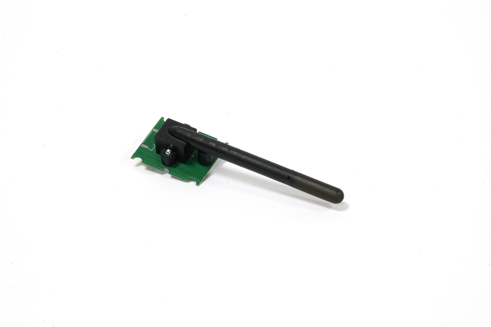
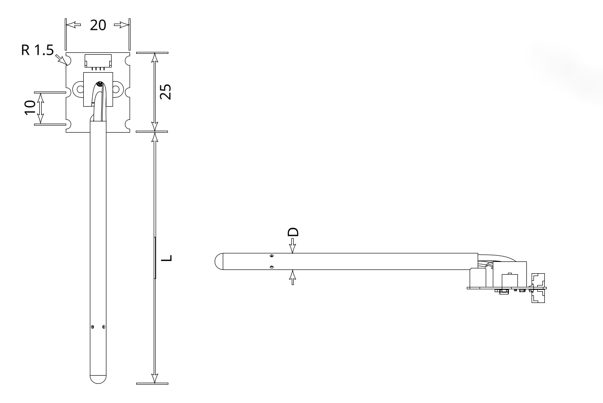
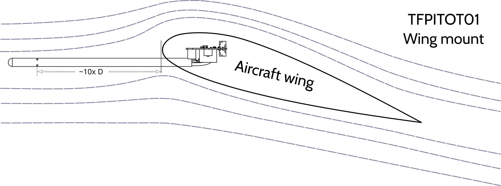
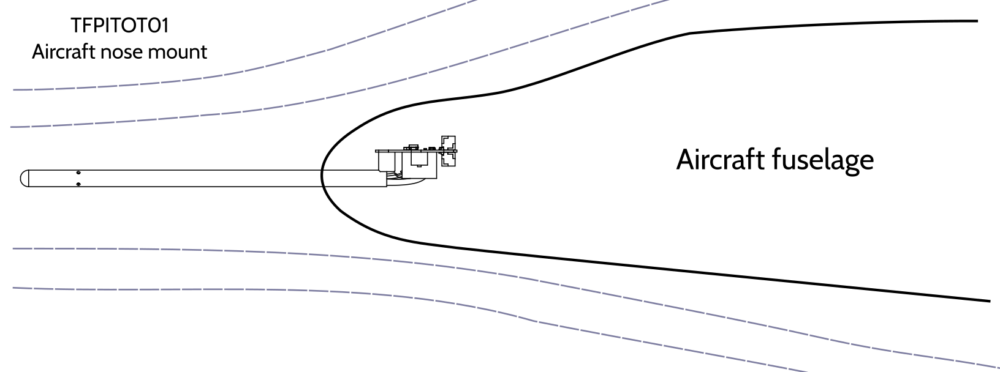
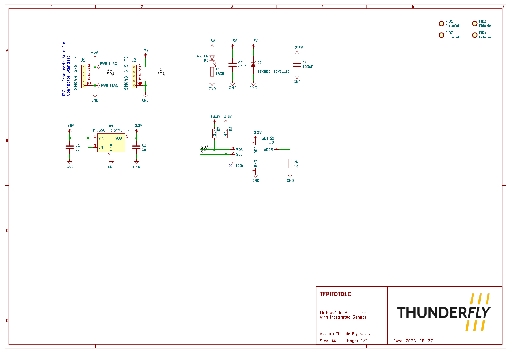

# TFPITOT01 - Lightweight Pitot Tube with Integrated Differential Pressure Sensor

The TFPITOT01 is an ultra-lightweight pitot tube that integrates the SDP33 sensor, providing a compact and reliable airspeed measurement solution. This design eliminates common issues associated with traditional low-cost pitot tubes, including temperature drift, offset, and the failure of tubing systems.

## Key Features
- **Compact Design** – Eliminates external tubing, reducing weight and enhancing reliability.
- **Stable Measurements** – No temperature drift or offset, ensuring high accuracy in various conditions.
- **High Moisture Resistance** – Designed to handle condensation and humidity, maintaining performance in challenging environments.
- **PX4 & Ardupilot Compatibility** – Seamless integration with popular flight control software for UAV applications.

## Availability and Customization

The TFPITOT01 is available from [ThunderFly s.r.o.](https://www.thunderfly.cz/)
- Direct orders can be placed via [Lectronz](https://lectronz.com/products/1062) or [Tindie store](https://www.tindie.com/products/37220/).
- For commercial inquiries, contact sale@thunderfly.cz.
- Customization, including length, diameter, or mounting modifications, is available upon request (typical lead time: 3 weeks).

## Technical Specifications

- **Sensor Configuration**: Pitot-static tube with dynamic and static pressure ports integrated
- **Sensor Type:** Sensirion SDP33
- **Measurement Range:** ±1500 Pa (1 m/s to 50 m/s), allowable overpressure 50 kPa
- **Repeatability:** ±3% of measured value (corresponds to ±1.5 m/s @ 50 m/s)
- **Zero Point Accuracy:** 0.2 Pa
- **Operating Temperature Range:** -40 °C to +65 °C
- **Default tube dimensions:** 45 mm L, 5.1 mm D
- **Weight:** 3.8 grams
- **Default I2C Address:** 0x21 (configurable to 0x22 or 0x23)

3D models are available in the [GitHub repository](https://github.com/ThunderFly-aerospace/TFPITOT01).

## Applications
The TFPITOT01 is designed for Unmanned Aerial Vehicles (UAVs), providing precise airspeed measurements for atmospheric monitoring, navigation, and performance optimization.

## Installation Guide

The airspeed sensor is supposed to be mounted in an aircraft's nose or a wing. 

In typical UAV applications, it is generally sufficient for the static pressure ports to be positioned at a distance of approximately 10 times the outer diameter of the tube from nearby airframe structures (such as the nose). Longer protrusions introduce unnecessary challenges related to stiffness, vibrations, and structural stability, unless used for specialized aerodynamic measurements.

Modern flight controllers (e.g., PX4, ArduPilot) further reduce the need for extended pitot tubes by dynamically correcting Indicated Airspeed (IAS) to Calibrated (CAS) and Equivalent Airspeed (EAS) using GPS and IMU data. These corrections effectively mitigate airframe-induced pressure distortions and allow for reliable airspeed readings even with shorter tubes.

### Mounting Instructions

To ensure reliable airspeed measurements, the pitot tube must be installed correctly:

1. The tube must be parallel to the airflow to guarantee accurate readings.
2. Mounting possibilities:
   - **Clamp Mounting:** Use a dedicated bracket or clamp to secure the tube.
   - **Adhesive Bonding:** Bond the tube into a pre-fabricated socket or flange on the fuselage or wing structure.
3. Ensure that the electronic components and I2C cable are sealed against moisture. Only the intake holes at the front of the pitot tube should be exposed to airflow.

The preferred orientation of the mounted sensor is PCB up. This position ensures that ingressed water can flow out or evaporate. This mounting is especially useful in situations where mounting is inside the wing. The sensor should be screwed to the bottom of the wing, and the electronics covered by a cap. 

### Electrical Connection
- Connect the TFPITOT01 to an unused I2C port on the flight controller. It is recommended to use the [EMC enhanced TFCAB01 I2C cables](/avionics/TFCAB01/).
- Configure the firmware settings to recognize the sdp3x sensor driver for airspeed measurements.

### Calibration
Follow the calibration check procedure as outlined in the documentation for your flight control firmware (PX4/Ardupilot) to achieve optimal accuracy.

## FAQ: Frequently Asked Questions

### Why wasn't a "more accurate" differential pressure sensor used instead of the SDP33?

Although some membrane-based differential pressure sensors, such as MS4525DO, DLVR-L30D, ELVH-L30D, or AUAV-L10D-M2515-RR-N, may claim higher static accuracy, they are not necessarily better suited for UAV airspeed sensing.

In real-world applications, what matters more than raw accuracy is the stability of the offset, high resolution, and repeatability. That significantly influences autopilot performance. Membrane sensors tend to suffer from mechanical hysteresis, offset drift, and sensitivity to vibration.

By contrast, the SDP33, a flow-based sensor used in the TFPITOT01, offers excellent resolution, offset stability, and minimal hysteresis. This leads to more consistent and reliable readings, especially in systems where flight controllers such as PX4 or ArduPilot apply onboard corrections (e.g., IAS → CAS → EAS → TAS). An additional practical advantage of the flow-based principle is that it allows slow airflow through the sensor, which helps remove accumulated moisture from the measuring tube.

### Can a pitot probe be used on a quadcopter?
Yes, a pitot probe can measure airspeed on a quadcopter as long as it is facing the relative airflow. In the case where the UAV always flies forward in a specific direction, the pitot tube will register dynamic pressure corresponding to the component of airspeed aligned with its axis.  

### How does the quadcopter’s pitch angle affect pitot tube measurements?  
A pitot probe only measures the airspeed component along its axis. If the quadcopter changes its pitch angle during flight, the probe may not capture the full airspeed but rather its projection onto the probe’s axis. This can lead to an underestimation of actual airspeed unless compensated.  

### How can I correct for pitch angle effects?
There are two common approaches:  
1. **Using the known attitude** – By integrating pitch angle data from an IMU, you can adjust the pitot tube reading to estimate true airspeed.  
2. **Using a multi-port airspeed sensor** – The multiple probes or a modified 5-hole TFPITOT probe can measure both airspeed and rough angle of attack, providing more accurate velocity data.  

### What airspeed range can a pitot tube measure on a quadcopter?
A pitot probe can generally measure airspeeds starting from a few meters per second. For a flight speed under 10 m/s, the [TFSLOT01 sensor](https://docs.thunderfly.cz/avionics/TFSLOT01/) is recommended for better accuracy.  

### Where should the pitot tube be mounted on an airframe?  
For best results, the probe should be placed:  
- In clean airflow, away from propeller wash and frame turbulence.  
- The tube tip should be facing directly into the relative wind to ensure accurate measurements.  
- Ideally, on a boom or mast extending forward to minimize aerodynamic disturbances.  

