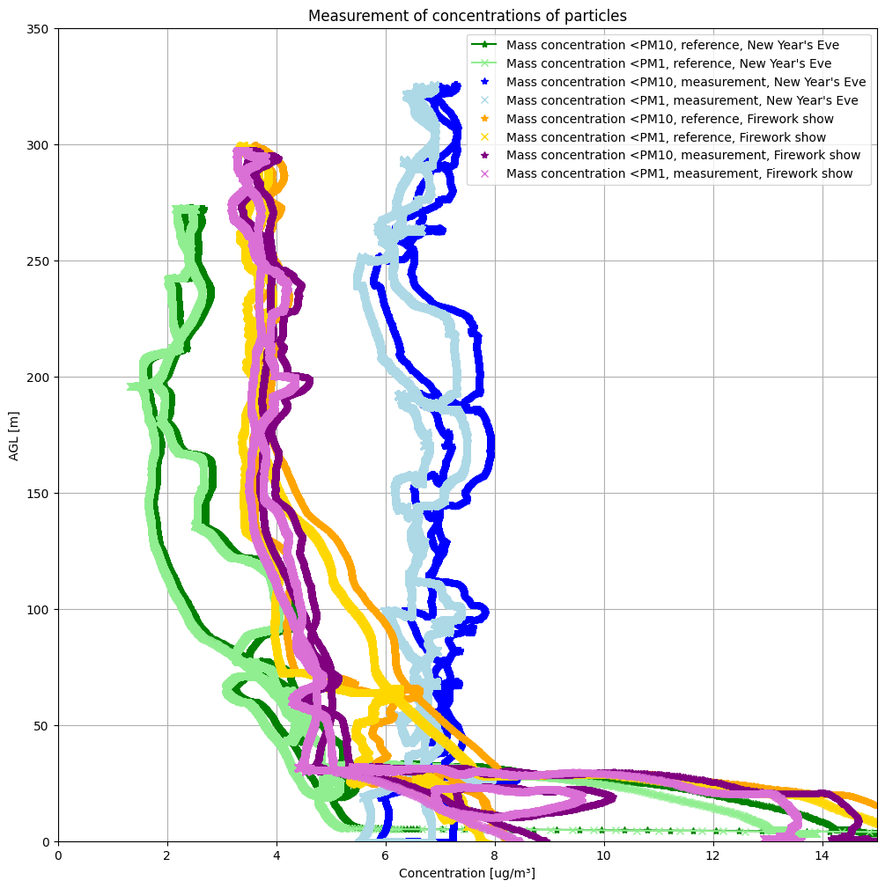
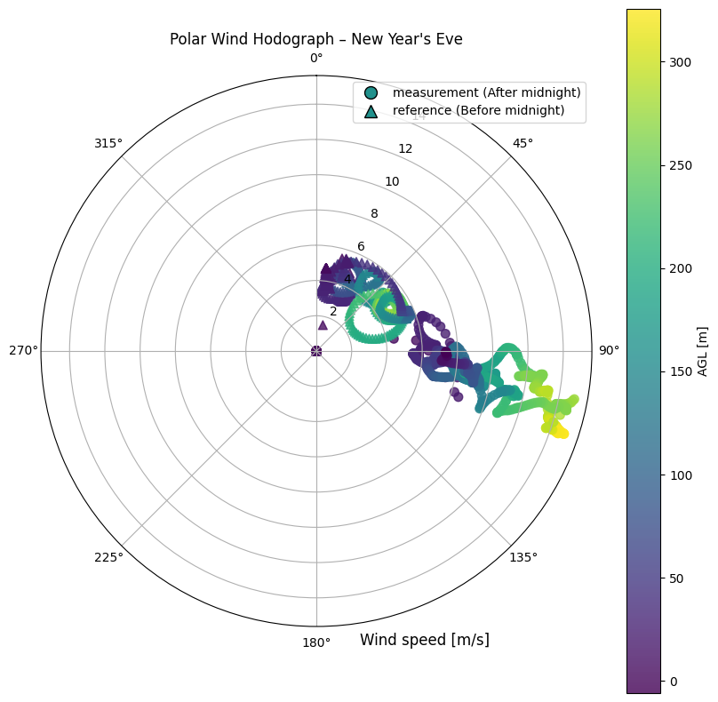
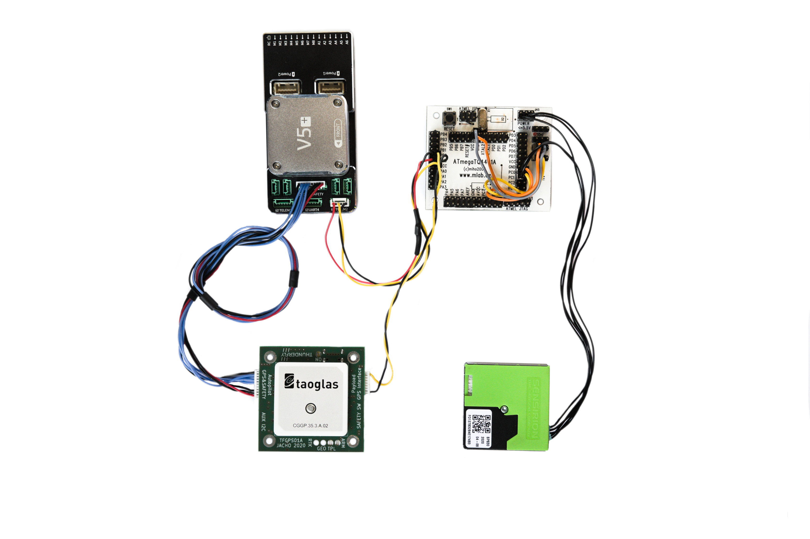

# TFPM01 – TFUNIPAYLOAD01-based TF-ATMON Particulate Matter Sensor

## Overview

The TFPM01 is the first generation airborne particulate matter sensor module designed for the [TF-ATMON](/instruments/TF-ATMON) atmospheric monitoring system. It is built around the [Sensirion SPS30](https://sensirion.com/products/catalog/SPS30/) dust sensor and utilizes the [TFUNIPAYLOAD01](/avionics/TFUNIPAYLOAD01) MAVLink interface in combination with a GPS time reference from [TFGPS01](/avionics/TFGPS01).

The sensor firmware is Arduino-based and runs on an ATmega1284P microcontroller. It converts real-time air quality data into MAVLink `TUNNEL` messages, allowing seamless integration with flight controllers and post-flight analysis in the TF-ATMON system.

> **Note**: TFPM01 is now considered obsolete and has been succeeded by [TFPM02](/avionics/TFPM02), which integrates more directly with PX4.

## Example Deployment: Fireworks Pollution Study

TFPM01 was successfully used in a study to monitor airborne particulate levels during New Year’s Eve, mounted on a [TF-G2 autogyro](/instruments/TF-G2). 

Detailed data analysis is available in this [notebook](https://github.com/ThunderFly-aerospace/TF-ATMON/blob/TF-ATMON01A/notebooks/fireworks_dust.ipynb).

## System Architecture and Connections

TFPM01 integrates the following components:

* **SPS30 sensor** – for particulate matter detection (PM1.0, PM2.5, PM4, PM10)
* **ATmega1284P** on [ATmegaTQ4401A](https://www.mlab.cz/module/ATmegaTQ4401A/) – runs firmware and prepares MAVLink messages
* **TFGPS01** – provides GPS and PPS synchronization
* **TFUNIPAYLOAD01** – provides standardized data interface to the autopilot via MAVLink

> The photo illustrates general layout; refer to table below for pin-level accuracy.

### SPS30 to MCU Wiring Table

| SPS30 Pin | Signal           | ATmega1284P (MCU) Pin      | Notes / Color |
| --------- | ---------------- | -------------------------- | ------------- |
| 1         | VDD (+5V)        | Vcc                        | Red           |
| 2         | SDA              | D17 / SDA with 10k pull-up | Black         |
| 3         | SCL              | D16 / SCL with 10k pull-up | Black         |
| 4         | Interface Select | GND (selects I2C)          | Black         |
| 5 (outer) | GND              | GND                        | Black         |

### GPS PPS Sync

The PPS signal from TFGPS01 is connected to pin **PD4 (Arduino pin 12)** on the MCU. This can be modified in [firmware source code](https://github.com/ThunderFly-aerospace/TFPM01/blob/13cda4ffa5fd143e18c20526534e9ce3898b00ca/SW/arduino/SPS30MAV_small/SPS30MAV_small.ino#L33).

## MAVLink Integration

TFPM01 outputs data via MAVLink TUNNEL messages over a serial port connected to a PX4-compatible autopilot. Data is automatically:

* Logged on-board in PX4 `.ulg` format
* Available for live viewing and inspection in QGroundControl if broadcasted
* Visualized in TF-ATMON tools with spatiotemporal tagging

For further instructions, refer to the [TFUNIPAYLOAD01 documentation](/avionics/TFUNIPAYLOAD01).

## Summary

TFPM01 demonstrated the feasibility of integrating high-quality particulate sensors in airborne missions without the need for custom autopilot firmware. Although superseded by TFPM02, it remains an example platform for development and experimentation in atmospheric aerosol monitoring.

---

**Repository**: [TFPM01 GitHub](https://github.com/ThunderFly-aerospace/TFPM01)

