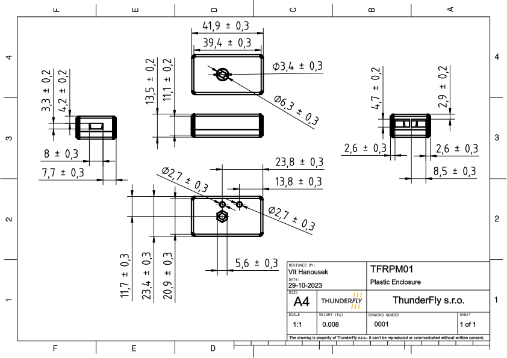

# Hardware

## PCB dimensions

The PCB is designed to be mounted on a flat surface by a center screw hole. The supposed screw diameter is metric 3mm e.g. DIN 912 M3 Hexagon socket Head Cap Screws. The [A2 stainless steel](https://en.wikipedia.org/wiki/SAE_304_stainless_steel) with non-ferromagnetic properties is used for the screw and nut to avoid influence on UAV's magnetometer. 

## Plastic box dimensions 

