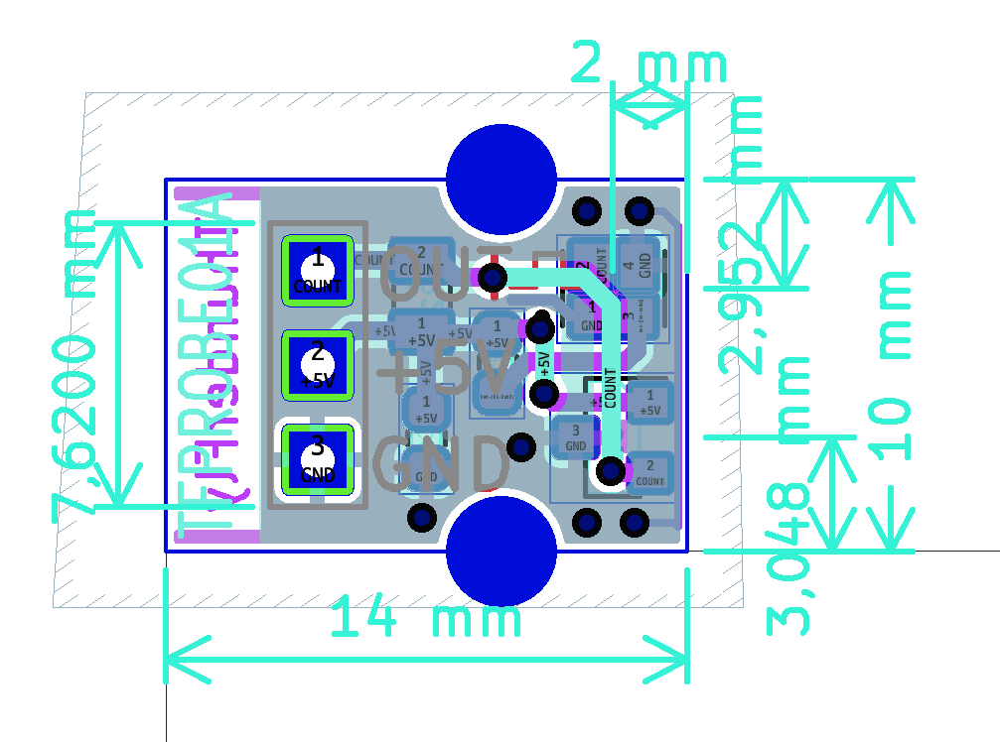

The TFRPM01D can be used with multiple types of sensor probes. The most used one is a Hall effect probe.  The magnetic probe is ideal for harsh environments, where dirt, dust, and water can contact the sensed rotor. The disadvantage is, that mounting of the magnet is required for proper sensor work.

The probe should be connected to the sensor board as follows (- Black, + Red, Pulse Blue)

The correct connection of the probe could be checked by the magnet, and the PULSE LED switch on and off according to magnet presence. The sensor board needs to be powered from at least one I²C port during the test.

The sensor could also be used with other probe types. We tested the se [TFPROBE01](https://github.com/ThunderFly-aerospace/TFPROBE01), which combines the optical reflective sensor and magnetic hall-effect sensor in one device.

## TFPROBE01A - Omnipolar magnetic and reflective optical sensor probe

The sensor is specifically designed for simple RPM measurement with the TFRPM01 sensor board. The probe consists dual sensing technique - optical or magnetic. Therefore the user should select the one most suitable for the application.

### Magnetic Sensing

The magnetic Hall-effect sensor mounted on the probe board can sense both directions of the magnetic field. The strength of the magnetic field is a decisive parameter for the probe's correct function. The magnetic flux is expected to be perpendicular to the sensor PCB surface. The detailed requirements of magnetic flux density are described in [AH3572 datasheet page 4](https://github.com/ThunderFly-aerospace/TFPROBE01/blob/TFPROBE01A/doc/datasheets/AH3572-1483253.pdf).

In magnetic sensing mode, it is recommended to cover the probe in a black shrinking tube.  The covering blocks the potentially unwanted function of a reflective sensor.

### Optical Sensing

An optical sensor is sensitive to the infrared reflectance of material (usually a rotating disc with marks).
To details see the [VCNT2020 datasheet page 2](https://github.com/ThunderFly-aerospace/TFPROBE01/blob/TFPROBE01A/doc/datasheets/vcnt2020.pdf) it should be noted that the optical sensor needs highly contrast sulface in IR spectrum. It is also sensitive to ambient sunlight and works correctly only on distances up to two millimeters.  

### TFPROBE Hardware specification
The TFPROBE01 is sold and shipped without a soldered header, because its orientation may depend on the customer's use. Connecting cable and two headers (one straight and one right-angled) are included.

### Optical and magnetic probe positions on PCB

## Use of other sensors

Technically TFRPM01 could be used by every probe with pulsed output with amplitude in the range of 0 to +5V. However, the TFRPM01 sensor needs to match the input parameters to certain probe types. The default configuration is reflected in the following schematics.

As can be seen from the schematics the default probe power selection is +5V, protected by resistor R2 to about 61 mA short-circuit current. The pull-up resistor R1 with a default value of 22 kOhm is quite hard and it is generally unsuitable to most optical probes with open-collector outputs. Therefore the resistor R1 should be interchanged to a more suitable (usually increased) value. It is depending on the selected material for the optical sensor this value might need further fine-tuning. (The specific resistor value could be requested during the order process in case of ordering a larger quantity).
