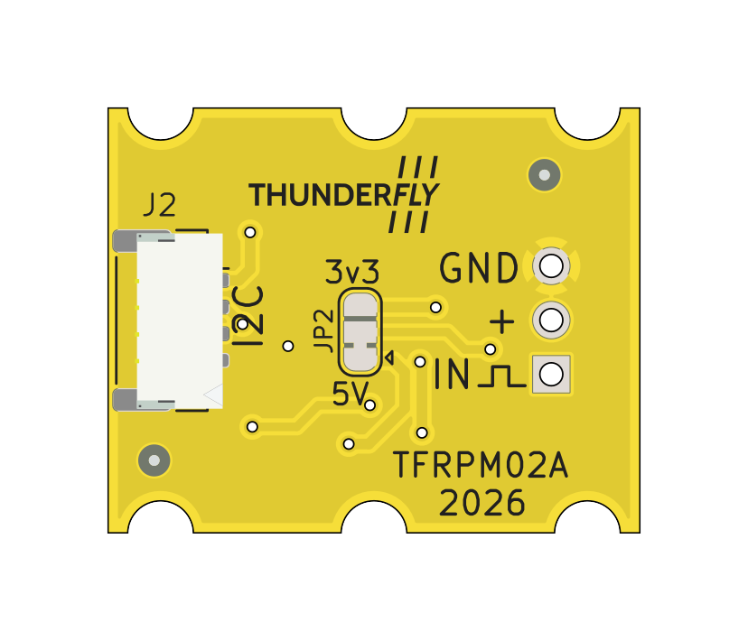
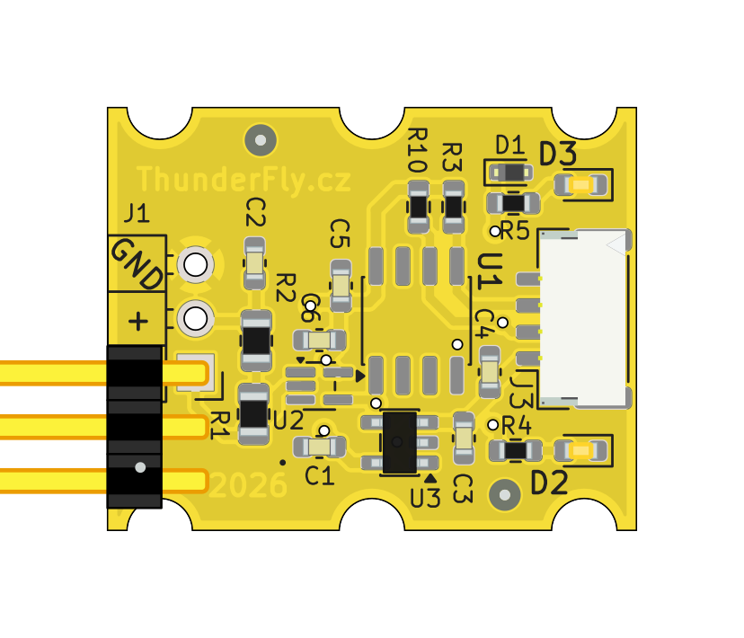

# TFRPM02 - RPM Measuring Device

The TFRPM02 is a compact RPM sensor for UAVs designed for direct connection to Pixhawk-class autopilots via the standard I²C port. It is the second-generation successor to the [TFRPM01](/avionics/TFRPM01/), sharing the same operating principle — a pulse-counting I²C counter IC — while adopting the unified ThunderFly avionics form factor and a smaller PCB footprint.

<p float="center">


</p>

The sensor accepts a pulse signal from an external sensing probe (optical encoder, Hall-effect sensor, etc.). Pulses are counted by the on-board I²C counter and read out periodically by the flight controller. The TFRPM02 uses the same PX4 `pcf8583` driver as the TFRPM01.

## Where to Buy?

For pricing, ordering, and quotations, see [Components Pricing & Ordering](https://docs.thunderfly.cz/avionics/#components-pricing).

## Main Features

* **Schmitt trigger input** — shapes noisy or slow-edge signals from Hall-effect or optical probes
* **I²C counter offloading** — the PCF8593 counts pulses autonomously, freeing the autopilot MCU
* **Status LED** — one pulse per revolution for easy mechanical verification
* **ThunderFly form factor** — 25 × 20 mm PCB, compatible with TF carrier boards and stacking
* **Overvoltage protection** — 5.6 V Zener clamp on the probe supply line
* **Internal 3.3 V LDO** — runs from the standard 5 V Pixhawk I²C bus

## Technical Specifications

| Parameter | Value | Description |
| --- | --- | --- |
| **Signal conditioning** | 74LVC1G14 Schmitt trigger | Single-channel inverting Schmitt trigger |
| **I²C address** | 0x50 (default) | Changeable to 0x51 via JP2 solder jumper |
| **I²C SCL frequency** | Max 100 kHz | |
| **Input voltage** | 3.6 – 5.4 V | Standard Pixhawk I²C bus voltage |
| **Probe supply** | 3.3 V via LDO | On-board MIC5504-3.3 LDO; probe supply filtered and protected |
| **Probe pull-up** | 22 kΩ | Internal pull-up to 3.3 V on probe signal line |
| **I²C connector** | JST-GH 4-pin | Pixhawk standard pinout |
| **Probe connector** | 3-pin 2.54 mm header | Same pinout as TFRPM01 |
| **PCB dimensions** | 25 × 20 mm | ThunderFly avionics form factor |

## Pin Configuration

### I²C Connector (JST-GH 4-pin)

Interface conforms to the [Pixhawk Connector Standard](https://github.com/pixhawk/Pixhawk-Standards/blob/master/DS-009%20Pixhawk%20Connector%20Standard.pdf).

| Pin | Name | Type | Description |
| --- | --- | --- | --- |
| 1 | VCC | Power | +5 V from autopilot |
| 2 | SCL | Input | I²C clock |
| 3 | SDA | I/O | I²C data |
| 4 | GND | Ground | Ground |

### Probe Connector (3-pin 2.54 mm header)

| Pin | Name | Description |
| --- | --- | --- |
| 1 | VCC | Probe supply (3.3 V from LDO) |
| 2 | SIGNAL | Pulse input with 22 kΩ pull-up to 3.3 V |
| 3 | GND | Ground |

## I²C Address Configuration

The default I²C address is **0x50**. The address can be changed to **0x51** by modifying the JP2 solder jumper: cut the default bridge between pads 1–2 and solder pads 2–3.

After changing the address, the PX4 driver must be started with the `-a 0x51` argument (see below).

## PX4 Autopilot Integration

The TFRPM02 is supported by the PX4 `pcf8583` driver.

### Enabling the Driver

Set the `SENS_EN_PCF8583` parameter to `1` in QGroundControl or via the MAVLink console, then reboot:

```
param set SENS_EN_PCF8583 1
```

After reboot the driver starts automatically on the external I²C bus at address 0x50.

### Manual Start via Console

To start the driver manually from the PX4 NSH console:

```
pcf8583 start -X -a 0x50
```

Where `-X` selects the external I²C bus and `-a 0x50` is the default I²C address. To verify:

```
pcf8583 status
```

To stop:

```
pcf8583 stop
```

### Driver Parameters

| Parameter | Default | Unit | Description |
| --- | --- | --- | --- |
| `SENS_EN_PCF8583` | 0 | — | Enable driver: `0` = disabled, `1` = enabled. Requires reboot. |
| `PCF8583_POOL` | 1 000 000 | µs | Sensor poll interval. Requires reboot. |
| `PCF8583_RESET` | 500 000 | counts | Counter reset threshold. The internal counter resets when this value is reached; lower values improve accuracy at the cost of more frequent resets. Requires reboot. |
| `PCF8583_MAGNET` | 2 | counts/rev | Number of pulses per revolution from the probe. Must match the number of magnets or encoder slots. Requires reboot. |

For more details on software setup and data interpretation, refer to the [PX4 ThunderFly tachometer documentation](https://docs.px4.io/main/en/sensor/thunderfly_tachometer.html).

## Sensor Probe Selection

The TFRPM02 is compatible with the same probes as the TFRPM01. The most common choice for UAV applications is a Hall-effect probe used together with a small magnet mounted on the rotating part. Optical probes (reflective or transmissive) are also supported.

For probe selection guidance, see the [TFRPM01 probe selection page](/avionics/TFRPM01/probe.html).

## Differences from TFRPM01

| Feature | TFRPM01 | TFRPM02 |
| --- | --- | --- |
| PCB size | 37.5 × 19 mm | 25 × 20 mm |
| I²C connectors | 2× JST-GH (pass-through) | 1× JST-GH |
| Power supply | Direct 5 V | 5 V with on-board 3.3 V LDO |
| Form factor | Custom | ThunderFly standard |
| PX4 driver | `pcf8583` | `pcf8583` (same) |

## Applications

* Helicopter and autogyro rotor RPM monitoring
* BLDC motor speed feedback
* Propeller and engine RPM measurement
* Any pulse-output rotary speed sensor application
