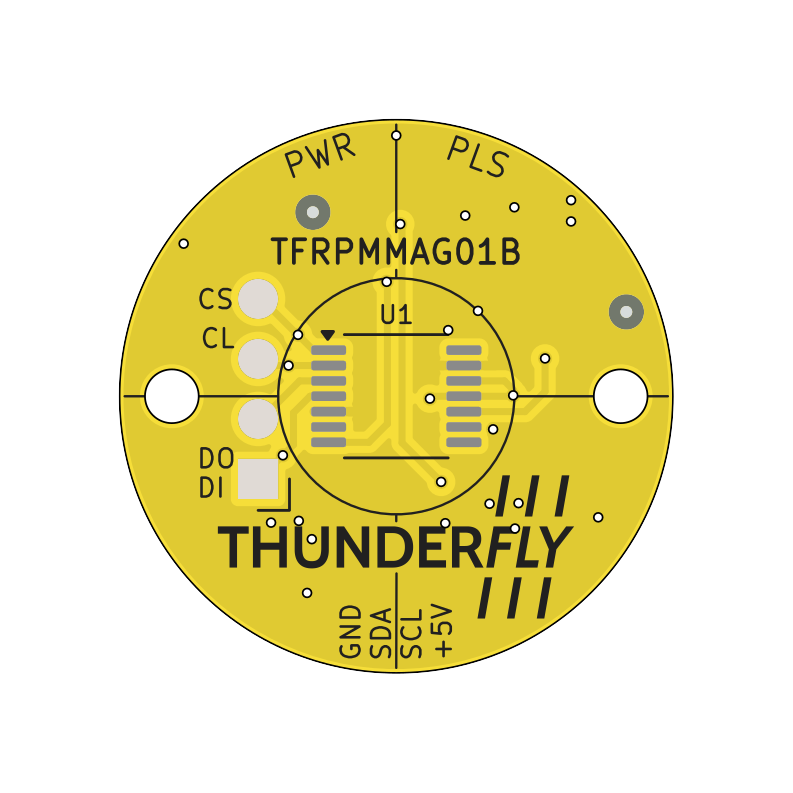
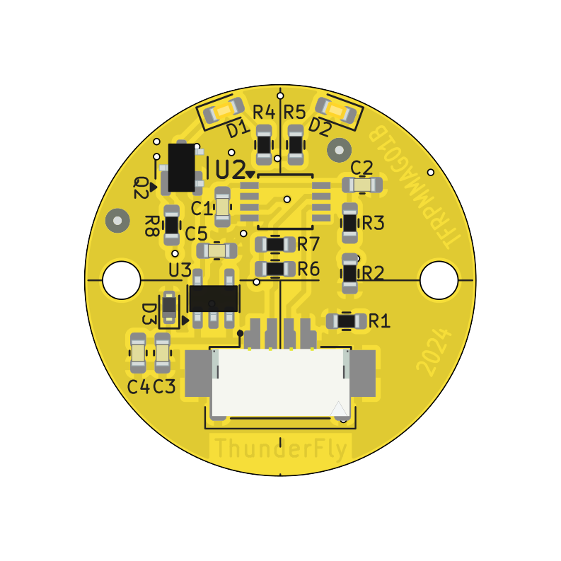
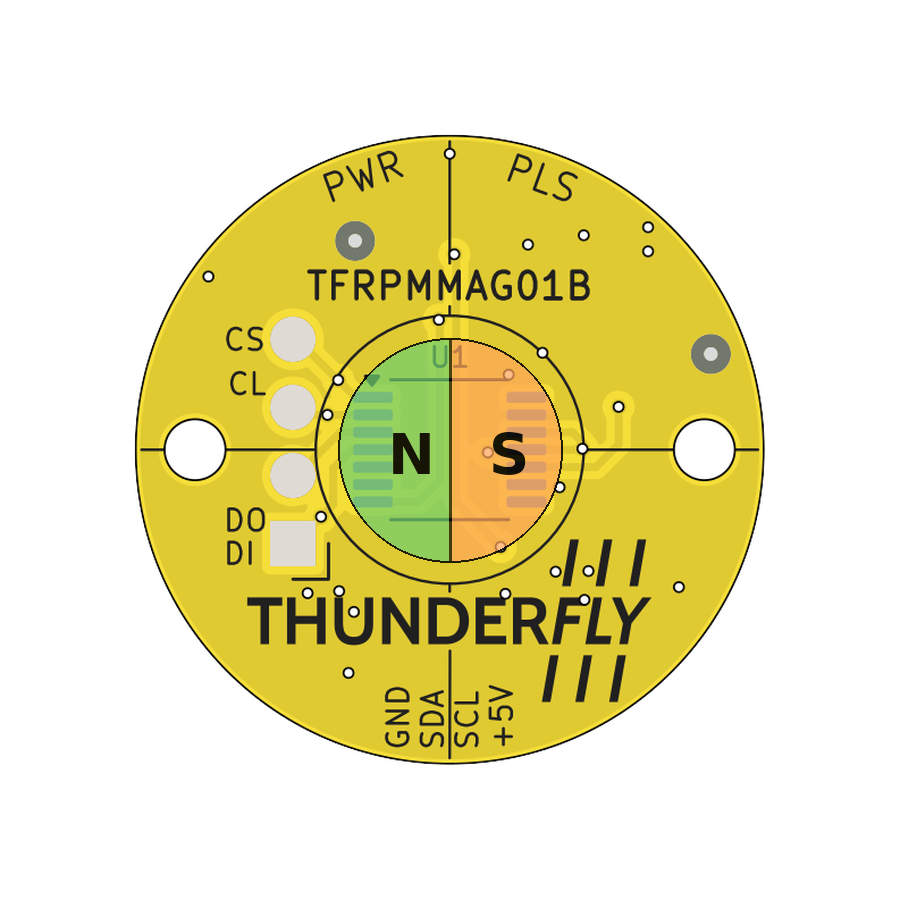

# TFRPMMAG01 - Magnetic RPM Sensor with I2C Interface

The TFRPMMAG01 is a compact sensor designed for measuring the RPM of diametrically magnetized rotating parts, primarily in UAV and drone applications. It supports direct connection to Pixhawk-based autopilot systems with PX4 firmware. The **high-speed measurement capability** and **compact design** make it a robust solution for UAV propulsion monitoring and general rotary speed sensing.

## Features

* **Designed for UAVs**: Compact round form factor optimized for drone integration
* **High-Speed Measurement**: Accurate up to 28,000 RPM
* **I2C Interface**: Simple connection to autopilots and controllers
* **Pixhawk Compatibility**: Plug-and-play support with PX4 firmware
* **High Resolution**: 14-bit precision for accurate RPM detection

## Where to Buy?

The TFRPMMAG01 is available from [ThunderFly s.r.o.](https://www.thunderfly.cz/).

For a quotation or support, contact us at [sale@thunderfly.cz](mailto:sale@thunderfly.cz).

## Technical Specifications

| Parameter                     | Value                                  | Description                            |
| ----------------------------- | -------------------------------------- | -------------------------------------- |
| **RPM Measurement Principle** | Diametrically magnetized rotating part | Ensures dust-reliable speed detection       |
| **Max. Operating Speed**      | 28,000 RPM                             | High-speed UAV and motor applications  |
| **Resolution**                | 14-bit                                 | Provides precise RPM and position data |
| **Interface**                 | I2C                                    | Standard 4-pin JST-GH connector        |
| **I2C Address**               | 0x40                                   | Default address, configurable in PX4   |
| **Input Voltage**             | 3.3 – 5 V                              | Supports common Pixhawk UAV bus voltages       |
| **Connector**                 | JST-GH 4-pin                           | Pixhawk standard Pixhawk pinout                |
| **Dimensions**                | 18 × 18 × 5 mm                         | Compact circular PCB                   |
| **Mass**                      | 2 g                                    | Without cable                          |

## Pin Configuration

Interface conforms to the [Pixhawk Connector Standard](https://github.com/pixhawk/Pixhawk-Standards/blob/master/DS-009%20Pixhawk%20Connector%20Standard.pdf).

| Pin | Name | Type   | Description             |
| --- | ---- | ------ | ----------------------- |
| 1   | VDD  | Power  | Power supply (3.3–5.5 V)  |
| 2   | SCL  | Input  | Serial Clock Line (I2C) |
| 3   | SDA  | I/O    | Serial Data Line (I2C)  |
| 4   | GND  | Ground | Ground connection       |

## Design and Functionality

The sensor detects RPM by measuring the rotation of a diametrically magnetized part. Its compact design allows for direct mounting in UAV propulsion systems. An indicator LED provides a visual pulse once per revolution, aiding in testing and calibration.

Place a diametrically magnetized disc magnet above the sensing area on the TOP side and keep it centered. Maintain a small axial air gap and avoid axial magnetization. Any rotation angle is acceptable; RPM is derived from the change of angle over time.

## PX4 Autopilot Integration

The PX4 firmware includes support for the TFRPMMAG01. When connected to the I2C bus of a Pixhawk flight controller, it is automatically detected and can be configured through standard PX4 parameters.

## Applications

* UAV propulsion monitoring
* RPM measurement in BLDC motor systems
* General-purpose rotary speed sensing

