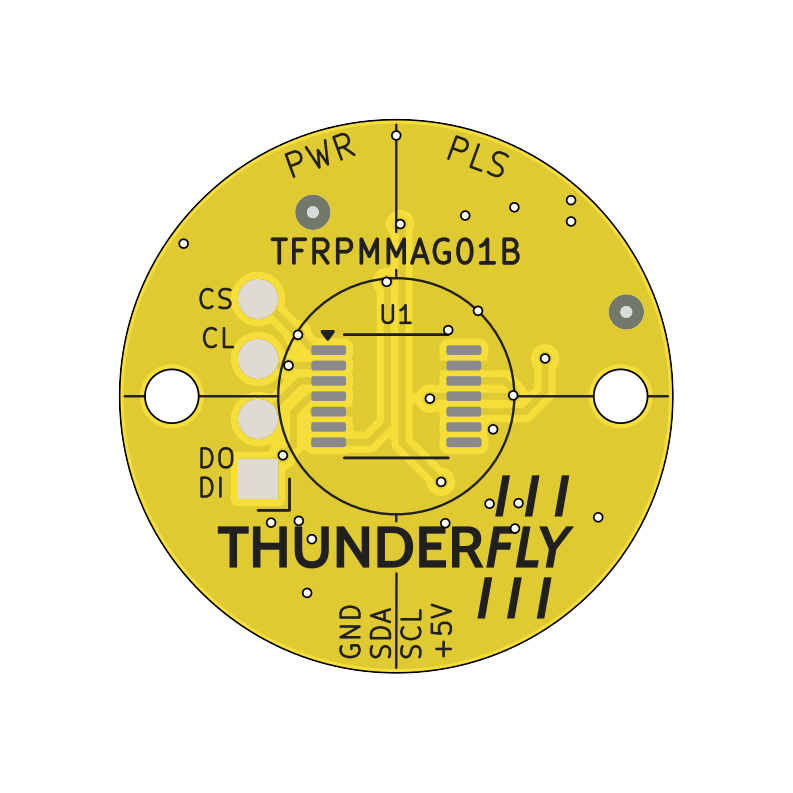
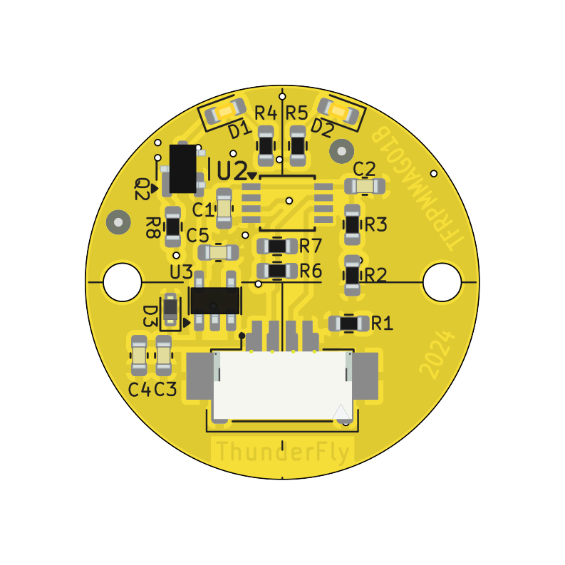
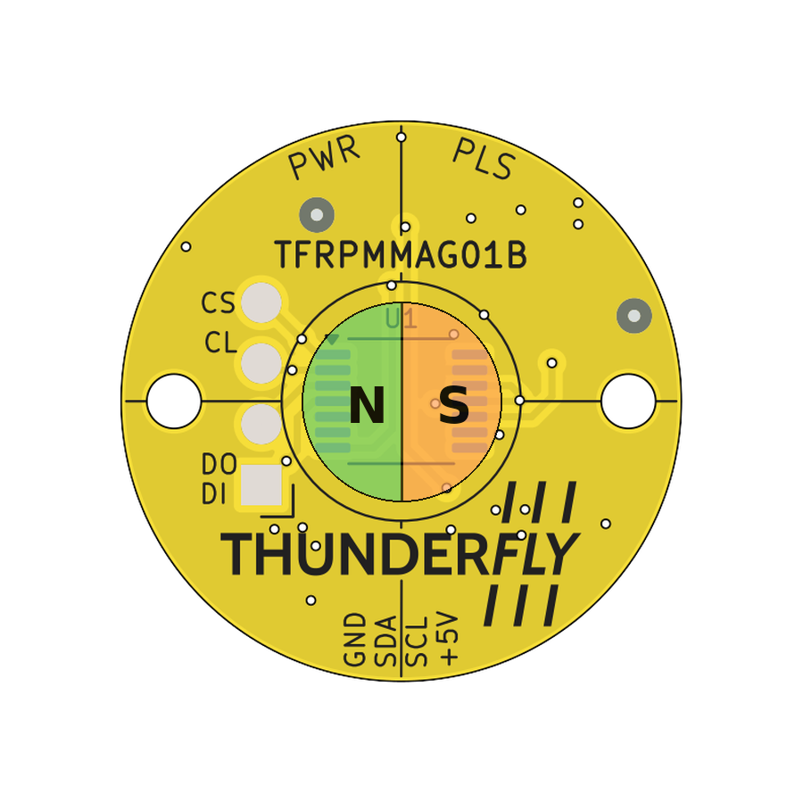
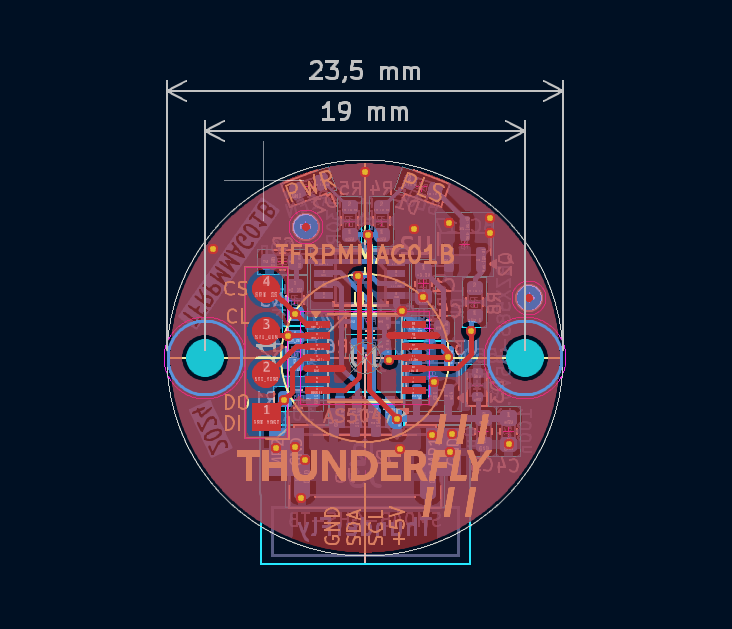

# TFRPMMAG01 - Magnetic RPM Sensor with I2C Interface

The TFRPMMAG01 is a compact sensor designed for measuring the RPM of diametrically magnetized rotating parts, primarily in UAV and drone applications. It supports direct connection to Pixhawk-based autopilot systems with PX4 firmware. The **high-speed measurement capability** and **compact design** make it a robust solution for UAV propulsion monitoring and general rotary speed sensing.

<p float="center">


</p>

## Features

* **Designed for UAVs**: Compact round form factor optimized for drone integration
* **High-Speed Measurement**: Accurate up to 28,000 RPM
* **I2C Interface**: Simple connection to autopilots and controllers
* **Pixhawk Compatibility**: Plug-and-play support with PX4 firmware
* **High Resolution**: 14-bit precision for accurate RPM detection

## Where to Buy?

For pricing, ordering, and quotations, see [Components Pricing & Ordering](https://docs.thunderfly.cz/avionics/#components-pricing).

## Technical Specifications

| Parameter                     | Value                                  | Description                            |
| ----------------------------- | -------------------------------------- | -------------------------------------- |
| **RPM Measurement Principle** | Diametrically magnetized rotating part | Ensures dust-reliable speed detection       |
| **Max. Operating Speed**      | 28,000 RPM                             | High-speed UAV and motor applications  |
| **Resolution**                | 14-bit                                 | Provides precise RPM and position data |
| **Interface**                 | I2C                                    | Standard 4-pin JST-GH connector        |
| **I2C Address**               | 0x40                                   | Default address, configurable in PX4   |
| **Input Voltage**             | 3.3 – 5 V                              | Supports common Pixhawk UAV bus voltages       |
| **Connector**                 | JST-GH 4-pin                           | Pixhawk standard Pixhawk pinout                |
| **Dimensions**                | 18 × 18 × 5 mm                         | Compact circular PCB                   |
| **Mass**                      | 2 g                                    | Without cable                          |

## Pin Configuration

Interface conforms to the [Pixhawk Connector Standard](https://github.com/pixhawk/Pixhawk-Standards/blob/master/DS-009%20Pixhawk%20Connector%20Standard.pdf).

| Pin | Name | Type   | Description             |
| --- | ---- | ------ | ----------------------- |
| 1   | VDD  | Power  | Power supply (3.3–5.5 V)  |
| 2   | SCL  | Input  | Serial Clock Line (I2C) |
| 3   | SDA  | I/O    | Serial Data Line (I2C)  |
| 4   | GND  | Ground | Ground connection       |

## Design and Functionality

The sensor detects RPM by measuring the rotation of a diametrically magnetized part. Its compact design allows for direct mounting in UAV propulsion systems. An indicator LED provides a visual pulse once per revolution, aiding in testing and calibration.



Place a diametrically magnetized disc magnet above the sensing area on the TOP side and keep it centered. Maintain a small axial air gap (< 1 mm) and avoid axial magnetization. Any rotation angle is acceptable; RPM is derived from the change of angle over time.

Dimensions of the sensor follow. The overall thickness is 0.6 mm PCB + 1.2 mm Sensor IC height. Therefore, 1.8mm in total. A 2 mm wide slit is usually a good design value, which allows manipulation with the sensor during maintenance.  



Nominal hole diameter in PCB is 2.2 mm. Acceptable screw head diameter is up to 4.4 mm.

## PX4 Autopilot Integration

The PX4 firmware includes a dedicated driver for the TFRPMMAG01 based on the S35770 I2C counter IC. The driver is part of the `rpm_sensor` module group.

### Enabling the Driver

The driver can be enabled permanently by setting the `SENS_EN_S35770` parameter to `1` in QGroundControl or via the MAVLink console:

```
param set SENS_EN_S35770 1
```

A reboot is required after changing this parameter. After reboot the driver starts automatically.

### Manual Start via Console

To start the driver manually from the PX4 NSH console (e.g., via MAVLink Shell), run:

```
s35770 start -X -a 50
```

Where `-X` selects the external I2C bus and `-a 50` sets the I2C address (decimal 50 = 0x32). To verify the driver is running:

```
s35770 status
```

To stop the driver:

```
s35770 stop
```

### Driver Parameters

| Parameter | Default | Unit | Description |
| --- | --- | --- | --- |
| `SENS_EN_S35770` | 0 | — | Enable driver: `0` = disabled, `1` = enabled. Requires reboot. |
| `S35770_POOL` | 1 000 000 | µs | Sensor poll interval. Requires reboot. |
| `S35770_MAGNET` | 1000 | counts/rev | Number of counter pulses per one full rotation of the actuator. Adjust to match the number of pole pairs or magnet pulses. Requires reboot. |

The `S35770_MAGNET` parameter is the most important one to configure correctly — it determines the RPM calculation accuracy. Set it to the number of magnetic pulses generated per revolution by your specific rotating assembly.

## Applications

* UAV propulsion monitoring
* RPM measurement in BLDC motor systems
* General-purpose rotary speed sensing

