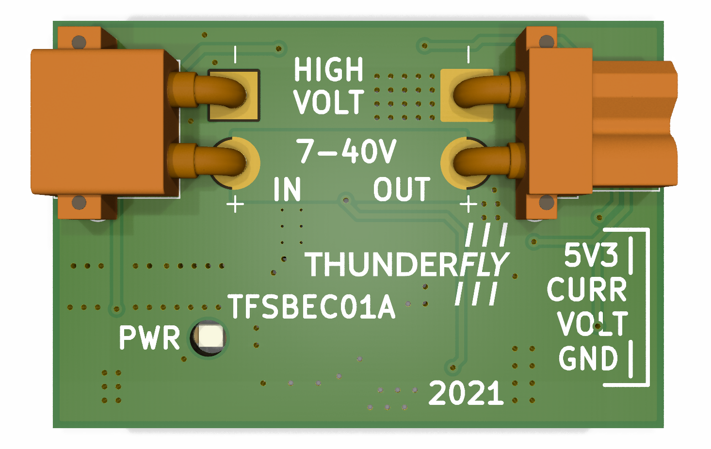
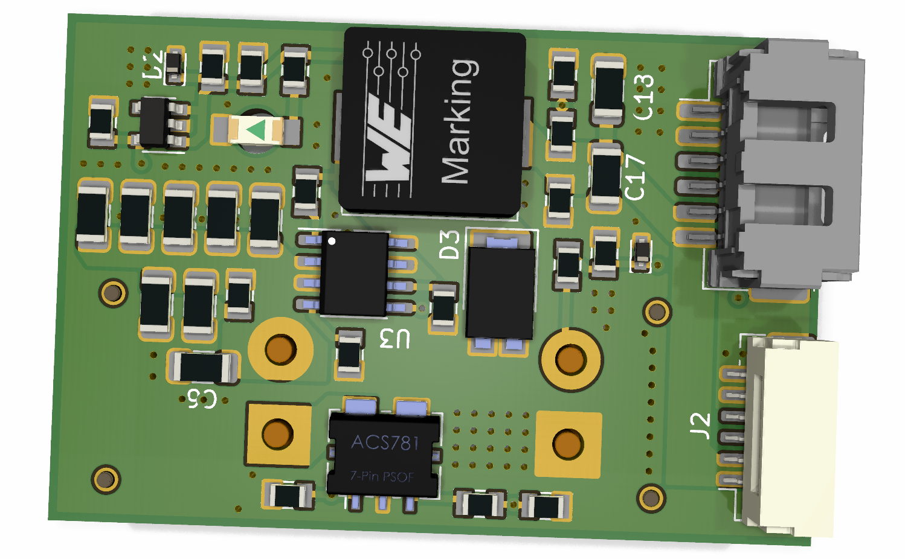

# TFSBEC01 - High Efficient Power Supply with Measuring Circuit for UAVs

The TFSBEC01 module is designed to provide a stable and efficient power supply for medium-power UAV components such as servos, autopilots, and other accessories. It also includes a measurement system for monitoring current and voltage, which is essential for demanding UAV applications where real-time consumption data is required.

## Features

- **Input Voltage:** 6 - 40 V (Equivalent to 2S to 9S Li-Po batteries)
- **Output Voltage:** 5.4 V, 5 A (Adjustable; based on the PX4 standard)
- **Current Measurement Range:** 0 - 50 A
- **Current Measurement Sensitivity:** 39.6 mV/A
- **Voltage Measurement Range:** 0 - 40 V
- **Size:** Approx. 46 x 30 mm
- **Compatibility:** Designed for Pixhawk-based drones but can be used in other UAV systems.

## Technical Specifications

| Parameter                      | Value            | Description                                             |
|---------------------------------|------------------|---------------------------------------------------------|
| **Input Voltage**               | 6 - 40 V         | Supports 2S to 9S Li-Po batteries                       |
| **Output Voltage**              | 5.4 V, 5 A       | Adjustable based on PX4 standards                       |
| **Current Measurement**         | 0 - 50 A         | Range for measuring current                             |
| **Current Sensitivity**         | 39.6 mV/A        |  |
| **Current Offset**              | 330 mV           | From component datasheet                                |
| **Voltage Divider**             | 10.13            | From the schematic                                      |
| **Regulator Technology**        | Switched step-down |  |
| **Connectors**                  | XT30             | Max current: 15 A                                       |
| **Size**                        | 46 x 30 mm       | Approximate PCB dimensions                              |

## Components

- [**LMR14050**](https://www.ti.com/lit/ds/symlink/lmr14050.pdf) - 5 A Step-down Converter with 40 V input voltage
- [**ACS780**](https://www.allegromicro.com/-/media/files/datasheets/acs780-datasheet.pdf) - High-Precision Current Sensor with 50 A capability
 
## PX4 Parameter Configuration

For Pixhawk systems, the following parameters can be used to set up the module:

- **BAT1_A_PER_V** = 25.2525
- **BAT_V_OFFS_CURR** = 0.33
- **BAT1_V_DIV** = 10.13

To estimate current values accurately, the equation used by the QGC system is:

)

Where:
- `A = 25.2525` (BAT1_A_PER_V)
- `B = 0.33` (BAT_V_OFFS_CURR)

For precise calibration, it is recommended to use QGC's built-in measurement feature to adjust these parameters based on the specific piece in use, but precise calibration is not required in cases where %5 precision is acceptable. For more details, refer to the [LMR14050](https://www.ti.com/lit/ds/symlink/lmr14050.pdf) and [ACS780](https://www.allegromicro.com/-/media/files/datasheets/acs780-datasheet.pdf) datasheets.

