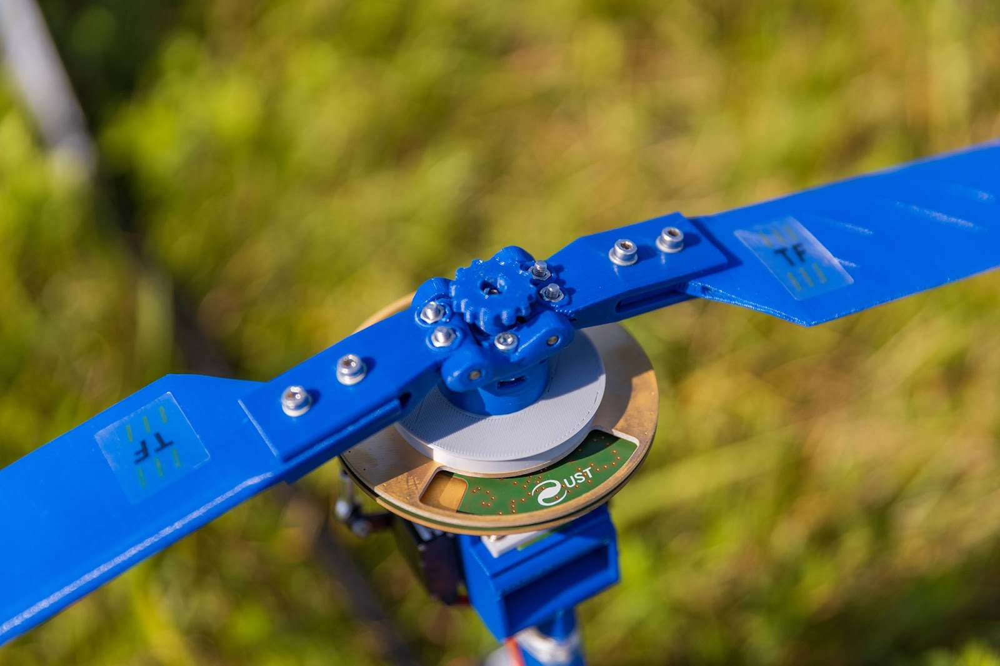
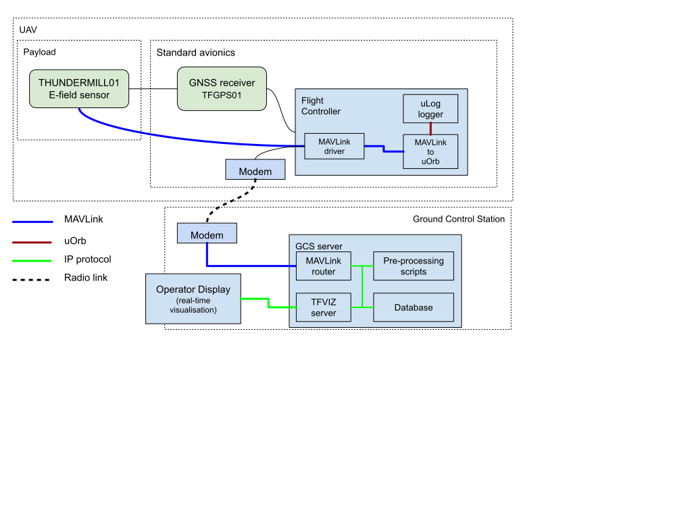

## THUNDERMILL01 - Electric Field Sensor for Unmanned Aerial Systems (UAS)

The THUNDERMILL01 is an [electric field mill](https://en.wikipedia.org/wiki/Field_mill) sensor developed for scientific measurements of atmospheric electric fields. It is specifically designed for airborne deployment on UAV platforms, with a focus on real-time monitoring in thunderstorm and atmospheric electricity research.

### Key Features of THUNDERMILL01

* Open-source hardware and software
* Optimized for UAV-borne operations
* Lightweight yet mechanically robust
* Real-time data visualization via [TF-ATMON](/instruments/TF-ATMON)
* Proven use on [TF-G2 autogyro](/instruments/TF-G2) during operational scientific missions ([CRREAT project - lightning research](https://crreat.eu/))

## Applications

* **Meteorology:** Local cloud monitoring and atmospheric analysis.
* **Thunderstorm and Weather Research:** Observation of storm-induced electric field variations.
* **Industrial Safety:** Protecting high-value equipment and personnel from electrical discharges.
* **Lightning Warning Systems:** Real-time monitoring for storm-related safety measures.
* **Emergency Management:** Decision support data during severe weather events.
* **HVDC Line Monitoring:** Monitoring of the anomalous electric field for high-voltage DC transmission lines.

### Where to get it?

THUNDERMILL01 was developed in collaboration with [Universal Scientific Technologies s.r.o.](https://www.ust.cz), who contributed to the initial design and continue to support the open-source hardware ecosystem. THUNDERMILL01 can be bought directly from ThunderFly via our [contact email](https://www.thunderfly.cz/contact-us.html). The same email can be used if you have specific requirements for custom modifications or if the product is to be purchased in large quantities.

## Technical Specifications

Main technical parameters, like resolution and measurement range, could be customized for the specific application required by the customer. 

| Parameter             |Specification        |
| ------------------------------ | --------------------------------------------------- |
| **Measurement Range**          | ±100 kV/m                         |
| **Resolution**                 | 50 V/m                                               |
| **Accuracy**                   | ±5%                                               |
| **Raw Data**                   | Complete waveform capture                                  |
| **Processed Output**           | Electric field intensity                                          
| **E-Field sampling Rate**      | 25 Hz Typical (Depends on RPM)     |
| **Time resolution**            | 521 us (Corresponds to ADC sample rate)|
| **Time Tagging**               | Optional integration with [TFGPS01](/avionics/TFGPS01/) GNSS receiver  |
| **Motor Type**                 | Ram-powered turbine (e.g., autogyro rotor)   |
| **Dimensions**                 | Cylindrical 80x20mm  |
| **Mass**                       | 34 grams (without cabling) |
| **Mounting Options**           | Autogyro rotor, wing, nose      |
| **Orientation**                | Up-looking (standard) or Side-looking (optional) |
| **Power Input**            | 20mA  @  5V DC  + External rotation force (5 W maximum)  |
| **Data Interface**             | (Pixhawk 6 pin JST-GH UART Telemetry)[/avionics/TFCAB01/#uarttelemserial-cables]    |
| **Data Visualization**         | [TF-ATMON](/instruments/TF-ATMON) sensor views  |
| **Temperature Range**      | -40°C to 40°C                         |
| **Humidity Range**         | 0–90% RH                                                 |
| **Weatherproof Rating**        | IP03                                              |

### System Diagram

The THUNDERMILL01 sensor is integrated into the TF-ATMON avionics system in the following way:

<!-- Source file https://docs.google.com/document/d/1RnSLQsT7pjinYLa-HK6KVlrG_cCLhdmITvdLSoMm3nQ/edit?tab=t.0 -->

### Connector pinouts

#### TF Payload port

This connector is primarily intended for time synchronization with the [TFGPS01 GNSS receiver](/avionics/TFGPS01), which provides location and time pulse signals (PPS) on its "Payload Connector".

| Signal    | Pixhawk Color                | ThunderFly Color                                  |
| --------- | ------------------------------------------------------- | ----------------------------------------------------------------------------------- |
| TIMEPULSE |  Black |  Blue     |
| EXTINT    |  Black |  Yellow |
| GPIO |  Black |  White   |
| SDA       |  Black |  Green   |
| SCL       |  Black |  Yellow |
| TX        |  Black |  White   |
| RX        |  Black |  Green   |
| GND       |  Black |  Black   |

#### J6 - Debug & programming UART Port

The UART interface is compatible with the [Pixhawk connector standard](https://github.com/pixhawk/Pixhawk-Standards/blob/master/DS-009%20Pixhawk%20Connector%20Standard.pdf) as a peripheral device and enables integration with onboard flight controllers. CTS is disconnected, and the RTS signal is used for the MCU reset for bootloader activation. 

| Signal | Pixhawk Color              | ThunderFly Color          |
| ------ | -------------------------- | ---------------------- |
| +5V    |  Red     |  Red       |
| RX     |  Black |  White   |
| TX     |  Black |  Green   |
| Not connected (CTS)  |  Black |  Blue     |
| RTS    |  Black |  Yellow |
| GND    |  Black |  Black   |

#### J1 - Pixhawk UART & I2C

| Pin | Signal    | Voltage level | Pixhawk Color    | ThunderFly Color  |
|-----|-----------|---------| -------|---------|
| 1   | VCC       | +5V     |  Red     |  Red       |
| 2   | RX (IN)  | +3.3V   |  Black |  White   |
| 3   | TX (OUT)  | +3.3V   |  Black |  Green   |
| 4   | I2C SCL   | +3.3V   |  Black |  Yellow |
| 5   | I2C SDA   | +3.3V   |  Black |  Green   |
| 6   | GND       | GND     |  Black |  Black   |

### Example of UAV Integration

The design has undergone extensive testing on the [ThunderFly TF-G2 autogyro](/instruments/TF-G2), where it is deeply integrated in the autogyro rotor head.

* **Mounting**: The sensor is mounted close to the autogyro rotor hub, taking advantage of the autogyro's principle to reduce electromagnetic interference and maximize measurement reliability.
* **Data Interface**: The THUNDERMILL01 sensor is typically connected to the Flight Controller and then routed into [TF-ATMON atmospheric monitoring system](/instruments/TF-ATMON), which handles real-time data acquisition, transmission, and visualization.
* **Telemetry Support**: The data from the sensor is streamed in real-time to a ground station. There, it is displayed in a 3D visualization environment to assist drone operators in decision-making during measurement flights.
* **Use Case**: Autogyro integration is especially suited for operations near thunderclouds, during convective events, where the electric field structure of the atmosphere needs to be investigated.

### Electromagnetic Considerations for UAV Mounting

Although the sensor can also be installed on multirotor UAVs, such configurations tend to introduce higher levels of electromagnetic noise. In such cases, appropriate shielding and post-processing techniques may be necessary to ensure data quality. Therefore, ram-powered rotation should be preferred where possible. Mounting the THUNDERMILL01 on the [TF-G2 autogyro](/instruments/TF-G2) has the unique property of an unpowered rotor, which has a very low electromagnetic signature. This allows for cleaner readings of the ambient electric field.

