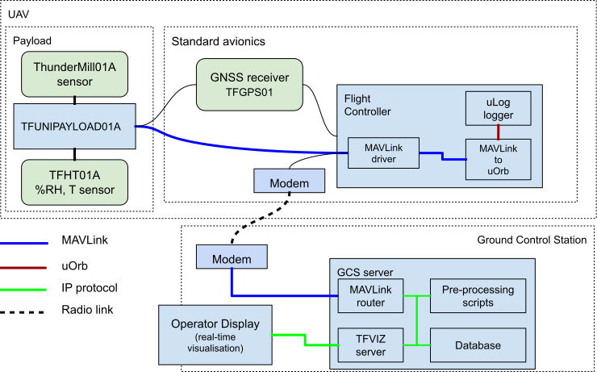

## THUNDERMILL01 - Electric Field Sensor for UAV Applications

The THUNDERMILL01 is an [electric field mill](https://en.wikipedia.org/wiki/Field_mill) sensor developed for scientific measurements of atmospheric electric fields. It is specifically designed for airborne deployment on UAV platforms, with a focus on real-time monitoring in thunderstorm and atmospheric electricity research.

### UAV Integration: THUNDERMILL01 Variant

The airborne version of THUNDERMILL01, has been specifically designed for use on unmanned aerial vehicles (UAVs) and is optimized for low-noise, mechanical stability, and integration with avionics systems. This version has undergone extensive testing on the [ThunderFly TF-G2 autogyro drone](https://www.thunderfly.cz/tf-g2.html).

* **Mounting**: The sensor is mounted close to the autogyro rotor hub, taking advantage of the autogyro's principle to reduce electromagnetic interference and maximize measurement reliability.

* **Data Interface**: The THUNDERMILL01 sensor is typically connected to the [TF-ATMON atmospheric monitoring system](https://docs.thunderfly.cz/instruments/TF-ATMON), which handles real-time data acquisition, transmission, and visualization.

* **Telemetry Support**: Using TF-ATMON, data from the sensor is streamed in real-time to a ground station. There, it is displayed in a 3D visualization environment to assist drone operators in decision-making during measurement flights.

* **Use Case**: It is especially suited for operations near thunderclouds, during convective events, or in campaigns investigating the electric field structure of the atmosphere.

### Electromagnetic Considerations for Rotorcraft Mounting

Mounting the THUNDERMILL01 on the TF-G2 autogyro leverages the unique property of its unpowered rotor, which has a very low electromagnetic signature. This allows for cleaner readings of the ambient electric field, making it a preferred platform for high-quality airborne data collection.

Although the sensor can also be installed on electrically powered multirotor UAVs, such configurations tend to introduce higher levels of electromagnetic noise. In such cases, appropriate shielding and post-processing techniques may be necessary to ensure data quality.

### System Diagram

The THUNDERMILL01 sensor is integrated to the TF-ATMON avionics system by following way:

### Key Features of THUNDERMILL01

* Open-source hardware and software
* Optimized for UAV-borne operations
* Lightweight and mechanically robust
* Real-time data visualization via TF-ATMON
* Proven use on TF-G2 during operational scientific missions (CRREAT project - lightning research)

### Where to get it?

THUNDERMILL01 can be bought directly from ThunderFly via our [contact email](https://www.thunderfly.cz/contact-us.html). The same email can be used if you have specific requirements for custom modifications or if the product is to be purchased in large quantities.

THUNDERMILL01 was developed in collaboration with [Universal Scientific Technologies s.r.o.](https://www.ust.cz), who contributed to the initial design and continue to support the open-source hardware ecosystem.

