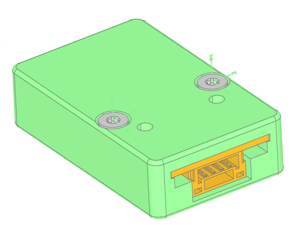

## Avionics Components  

ThunderFly's avionics system consists of **high-performance hardware** designed to enhance the capabilities of standard unmanned aerial vehicles (multicopter, airplane, etc.). ThunderFly avionics components are built for seamless integration into existing UAV platforms like [PX4](https://px4.io/) or [Ardupilot](https://ardupilot.org/).   

```mermaid
flowchart TD
    %% Central flight controller
    FC[TFPILOTBASEBOARD01 (Pixhawk-class flight controller)]

    %% SPI peripherals (double line)
    FC ==> TFLORA[TFLORA]
    click TFLORA "https://docs.thunderfly.cz/avionics/TFLORA/" "TFLORA Documentation"

    %% I2C peripherals (dashed line)
    FC -.-> TFI2CADT01[TFI2CADT01]
    click TFI2CADT01 "https://docs.thunderfly.cz/avionics/TFI2CADT01/" "TFI2CADT01 Documentation"

    %% I2C ESC connected directly to FC
    FC -.-> TFESC02[TFESC02]

    %% I2C extension chain
    TFI2CADT01 -.-> TFI2CEXT01[TFI2CEXT01]
    click TFI2CEXT01 "https://docs.thunderfly.cz/avionics/TFI2CEXT01/" "TFI2CEXT01 Documentation"

    TFI2CEXT01 -.-> TFPITOT01[TFPITOT01]
    click TFPITOT01 "https://docs.thunderfly.cz/avionics/TFPITOT01/" "TFPITOT01 Documentation"

    %% Sensors attached via I2C directly to ADT
    TFI2CADT01 -.-> TFHT01[TFHT01]
    click TFHT01 "https://docs.thunderfly.cz/avionics/TFHT01/" "TFHT01 Documentation"

    TFI2CADT01 -.-> TFHT02[TFHT02]
    click TFHT02 "https://docs.thunderfly.cz/avionics/TFHT02/" "TFHT02 Documentation"

    TFI2CADT01 -.-> TFRPM01[TFRPM01]
    click TFRPM01 "https://docs.thunderfly.cz/avionics/TFRPM01/" "TFRPM01 Documentation"

    %% TFSLOT01 is an I2C sensor (dashed line)
    TFI2CADT01 -.-> TFSLOT01[TFSLOT01]
    click TFSLOT01 "https://docs.thunderfly.cz/avionics/TFSLOT01/" "TFSLOT01 Documentation"

    %% UART devices (solid line)
    FC --> TFGPS01[TFGPS01]
    click TFGPS01 "https://docs.thunderfly.cz/avionics/TFGPS01/" "TFGPS01 Documentation"

    FC --> TFGPSLITE02[TFGPSLITE02]
    click TFGPSLITE02 "https://docs.thunderfly.cz/avionics/TFGPSLITE02/" "TFGPSLITE02 Documentation"

    %% USB/Serial converter
    FC --> TFUSBSERIAL01[TFUSBSERIAL01]
    click TFUSBSERIAL01 "https://docs.thunderfly.cz/avionics/TFUSBSERIAL01/" "TFUSBSERIAL01 Documentation"

    %% Power: use solid line with label (Mermaid v10 flowcharts don't support wavy ~~~>)
    BATT[Battery Pack] -- PWR --> FC
    BATT -- PWR --> TFESC02

    %% Legend
    subgraph Legend
      SPINodeA==>SPINodeB
      I2CNodeA-.->I2CNodeB
      UARTNodeA-->UARTNodeB
      PowerNodeA-- PWR -->PowerNodeB
    end
```

The development was originally motivated by the hardware requirements of [TF-ATMON](https://docs.thunderfly.cz/instruments/TF-ATMON), which focuses on atmospheric measurements in harsh conditions. Therefore, the solution covers the entire workflow — from sensors and in-flight data acquisition, through data transmission, to final visualization — and this use case shaped the design of avionics. All modules are developed and manufactured in Europe to meet common aerospace and research standards.  

### ThunderFly Form Factor

ThunderFly avionics modules are designed according to an internal PCB form factor standard. This allows for reducing weight and maintaining compatibility between different devices.


The dimensions of the PCB are defined by three parameters:

- **a** – additional width (integer, may also be 0)  
- **b** – lengt (integer)  
- **c** – additional mounting holes positions (integer, may also be 0)  

> Most commonly, the module width is 15 mm or 20 mm (e.g., a=0 or a=5), depending on the JST-GH connector number of pins (typically 4-pin for I²C).
> Mounting notches with a radius of 1.5 mm are positioned on both sides of the PCB. May be skipped (even asymmetrically) for relevant construction reasons. Their placement is measured from the connector edge.

#### Status Indicators

Each ThunderFly avionics module is equipped with status LEDs to provide quick visual feedback during operation. Typical meaning is as follows: 

- **Green LED** – usually indicates either power presence or that the module is functioning correctly.  
- **Red LED** – typically used for error or fault indication, highlighting abnormal states.  
- **Other colors** (blue, orange, yellow) – reserved for different operational statuses depending on the specific module.  

#### Example of Enclosure Mounting

The standardized PCB form factor allows straightforward design of **protective enclosures**.   Modules can be fixed inside 3D-printed or CNC-machined cases using the PCB notches. PCB then slides into the slots of the enclosure, and notches enable secure mounting with just two screws.




This approach results in avionics modules mechanically protected while still being lightweight and accessible to service.  The described modular block concept allows either grouping multiple avionics units together or distributing them in different airframe compartments, depending on application requirements.

### How to Order

You can order avionics components in the following ways:

- **Directly from ThunderFly** — use our [Contact us](https://www.thunderfly.cz/contact-us.html) page to request a quotation, check lead times, or discuss bulk pricing.
- **Online marketplaces**
  - **[Tindie](https://www.tindie.com/stores/thunderfly/)** — suitable for worldwide orders
  - **[Lectronz](https://lectronz.com/stores/thunderfly)** — recommended for customers in Europe.

### Components Pricing

The following table lists wholesale prices for avionics components for orders up to 50 units. For bulk pricing or special requirements, please directly contact sale@thunderfly.cz.

| Product Name       | Price (1–3 pcs) | Price (4–10 pcs) | Price (11–50 pcs) |
|--------------------|------------------|-------------------|--------------------|
| [TFRPM01](https://docs.thunderfly.cz/avionics/TFRPM01/) | €74,00 | €70,30 | €66,60 |
| [TFPROBE01](https://docs.thunderfly.cz/avionics/TFRPM01/probe#tfprobe01a---omnipolar-magnetic-and-reflective-optical-sensor-probe) | €27,00 | €25,65 | €24,30 |
| [TFI2CADT01](https://docs.thunderfly.cz/avionics/TFI2CADT01/) | €89,00 | €84,55 | €80,10 |
| [TFSLOT01](https://docs.thunderfly.cz/avionics/TFSLOT01/) | €298,00 | €283,10 | €268,20 |
| [TFHT01](https://docs.thunderfly.cz/avionics/TFHT01/) | €81,00 | €76,95 | €72,90 |
| [TFHT02](https://docs.thunderfly.cz/avionics/TFHT02/) |	€60,75 | €57,71	| €54,68 |
| [TFUSBSERIAL01](https://docs.thunderfly.cz/avionics/TFUSBSERIAL01/) | €86,00 | €81,70 | €77,40 |
| [TFPITOT01](https://docs.thunderfly.cz/avionics/TFPITOT01/) | €148,00 | €140,60 | €133,20 |
| [TFGPS01](https://docs.thunderfly.cz/avionics/TFGPS01/) | €280,00 | €266,00 | €252,00 |
| [TFGPSLITE02](https://docs.thunderfly.cz/avionics/TFGPSLITE02/) | €143,00 | €135,85 | €128,70 |
| [TFI2CEXT01](https://docs.thunderfly.cz/avionics/TFI2CEXT01/) | €92,00 | €87,40 | €82,80 |
| [TFSIK01](https://docs.thunderfly.cz/avionics/TFSIK01/) | €323,83 | €307,64 | €291,45 |
| [TFCAB15I2C01](https://docs.thunderfly.cz/avionics/TFCAB01/) | €8,00 | €7,60 | €7,20 |
| [TFCAB20I2C01](https://docs.thunderfly.cz/avionics/TFCAB01/) | €8,50 | €8,08 | €7,65 |
| [TFCAB45I2C01](https://docs.thunderfly.cz/avionics/TFCAB01/) | €9,00 | €8,55 | €8,10 |

> **Note:**
> - All prices are in EUR and **exclude VAT and shipping costs**.
> - Pricing valid from **28 August 2025**.
> - **Payment**: In advance via bank transfer based on a proforma invoice.
> - **Shipping**: Costs depend on destination and carrier; quotes available on request.
> - **Lead time**: Standard quantities are usually shipped within a week, with a maximum lead time of up to 4 weeks. Lead times for bulk orders may vary.
> - **Warranty**: Standard 6-month warranty. Extended warranty options are available on request.

