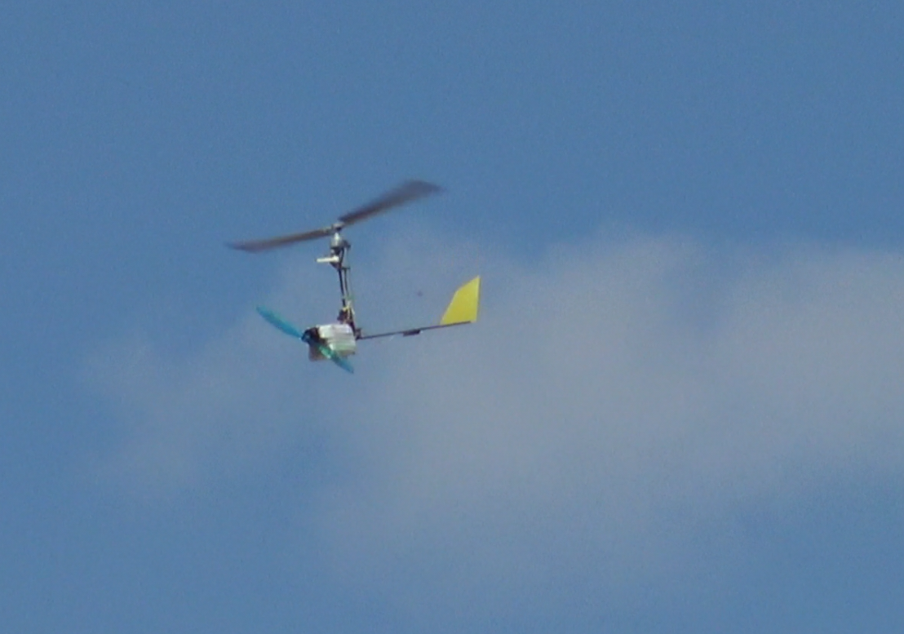
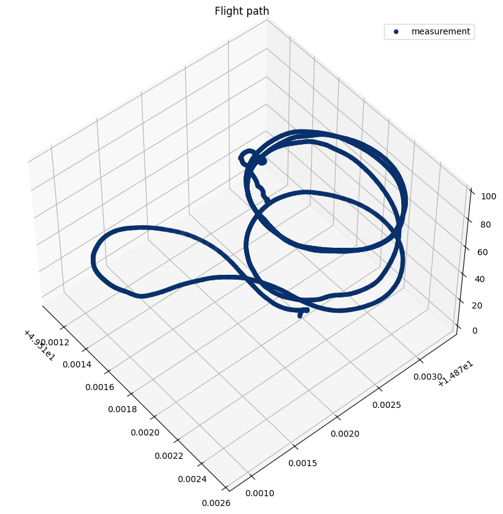
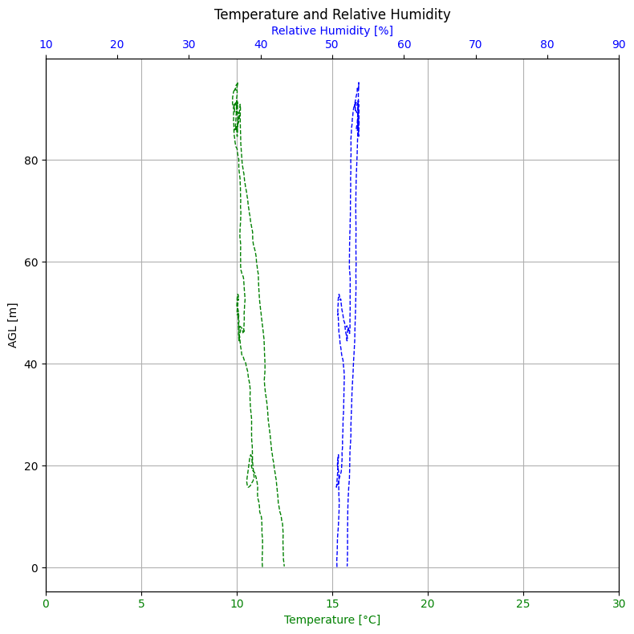
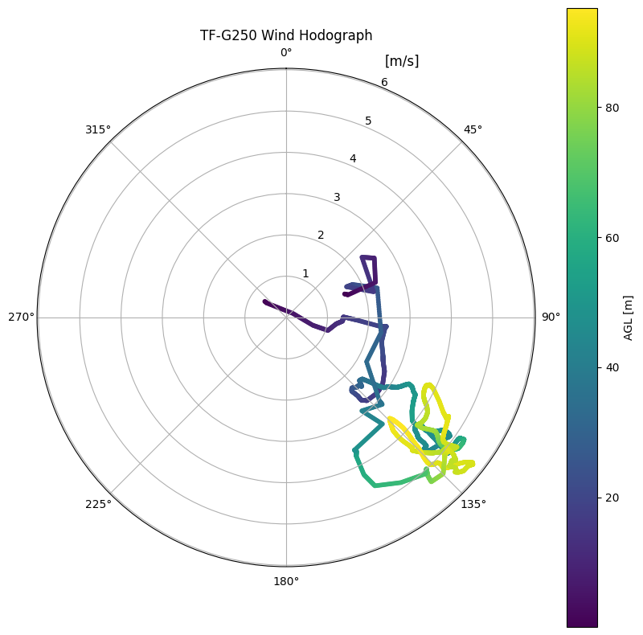
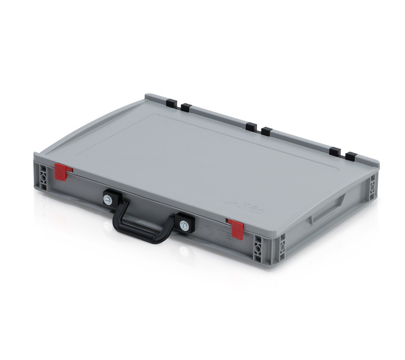

# TF-G250 - Unmanned Aerological Autogyro

The TF-G250 is a miniature unmanned autogyro specifically designed for atmospheric boundary layer sounding. It serves as a practical and ecological alternative to conventional balloon-based radiosondes, performing [atmospheric profiling](https://en.wikipedia.org/wiki/Atmospheric_sounding) of key meteorological parameters: temperature, humidity, wind speed and direction, and atmospheric pressure.

The TF-G250 combines the simplicity of a balloon with the control of a drone — providing an innovative, reusable platform for high-resolution atmospheric profiling. It is designed for easy handling, deployment, and maintenance, ensuring affordability and robustness in diverse meteorological conditions. Its compact and lightweight structure (below 250 grams, complying with the [European C0 category](https://www.easa.europa.eu/en/domains/drones-air-mobility/operating-drone/open-category-low-risk-civil-drones)) simplifies transport and storage, making it ideal for rapid deployment scenarios.

  <iframe style="width: 100%;height: 100%;position: absolute;top: 0;left: 0;"
          src="https://www.youtube.com/embed/cQeZ3FQAzD4?mute=1"
          frameborder="0" allowfullscreen>
  </iframe>

The TF-G250 addresses a rapidly growing global demand for cost-effective, reusable atmospheric sounding tools. Unlike traditional radiosonde solutions, the TF-G250 meteo autogyro drone offers significant operational advantages due to its lightweight, absence of parachute, inherent safety mechanisms, and safe-descent design.

## Why Choose the TF-G250?

* **Fully controlled and safe descent** — autorotation eliminates the need for a parachute.
* **Energy-efficient design** — energy recuperation during descent reduces battery mass.
* **Low operating cost and high reusability** — unlike disposable sondes.
* **Greater usable ceiling** than typical multirotors of comparable weight.
* **Wind gust resistance** — The autogyro airframe is inherently stable by principle of flight and, therefore, less affected by sudden gusts than multirotor or fixed-wing platforms, ensuring operation even under turbulent weather.
* **Benign glide path** ensures low airspace risk in case of emergency.

These properties make TF-G250 an ideal solution for research institutions and meteorological services seeking a sustainable and repeatable atmospheric profiling alternative to classical radiosondes.

## Key Design Features

* Integrated sensor payload for basic atmospheric measurements (temperature, humidity, pressure, wind speed, and direction)
* Does not require energy for the descent phase, enabling reduced battery weight
* Automatic fail-safe landing without requiring parachutes or additional mechanisms
* Effective operational altitude up to 3240 meters above ground
* Real-time telemetry for atmospheric data publication and processing
* Extremely low maintenance with easy repairability
* Optimized rotor design allows manual spin-up by hand before launch, enabling takeoff even without ambient wind
* High resistance to icing — the centrifugal rotor effect combined with ice-phobic surface treatment provides passive anti-icing protection
* Low acoustic signature

### Purchasing Information

The TF-G250 is currently available for research, testing, and pilot deployments. For quotations, technical consultations, or cooperation proposals, please contact [ThunderFly s.r.o.](https://www.thunderfly.cz/) directly at [sale@thunderfly.cz](mailto:sale@thunderfly.cz).

We are the original developers and manufacturers of the TF-G250 platform, which gives us full control over its design and customization. This allows us to adapt the configuration to specific mission profiles or integrate additional instrumentation upon request. Custom configurations (sensor payloads, telemetry frequencies, or autopilot integration) can be supplied individually.

## Technical Specifications

| Parameter                     | Specification                                           |
| ----------------------------- | ------------------------------------------------------- |
| Maximum Take-off Weight       | < 250 g (C0 category)                                   |
| Operational Altitude          | ~3.2 km AGL self-powered, ~32km AMSL balloon-launched   |
| Power Supply                  | 2S Li-ion battery (2×18650, ~19 Wh)                    |
| Endurance                     | ~17 min climb / ~20 min total cycle                    |
| Temperature Range             | –40 to +40 °C                                           |
| Temperature Accuracy          | ±0.2 °C (typical)                                       |
| Temperature Resolution        | 0.01 °C                                                 |
| Relative Humidity Range       | 0–100 %RH                                               |
| Relative Humidity Accuracy    | ±1.5 % RH (typical)                                     |
| Relative Humidity Resolution  | 0.01 % RH                                               |
| Pressure Range                | 3–110 kPa                                               |
| Pressure Accuracy             | ±20 Pa (typical)                                        |
| Pressure Resolution           | 1 Pa                                                    |
| Wind Speed Range              | TBD                                                     |
| Wind Speed Accuracy           | ±0.2 m/s                                                |
| Wind Speed Resolution         | 0.1 m/s                                                 |
| Wind Direction Range          | 0 to 360°                                               |
| Wind Direction Accuracy       | ±2°                                                     |
| Wind Direction Resolution     | ±0.1°                                                   |
| Effective Vertical Resolution | 5 m                                                     |
| Data Output Format            | BUFR-compatible                                         |
| Telemetry                     | Real-time via onboard radio modem                       |

## Meteorological Applications

The TF-G250 is primarily designed for vertical atmospheric profiling, making it particularly suited for capturing high-resolution meteorological data throughout the atmospheric boundary layer.

* **Temperature and Humidity Measurements:** Temperature and relative humidity are measured directly by a fast-response atmospheric sensor probe, positioned in the undisturbed airflow to ensure high accuracy across vertical profiles essential for weather forecasting, including storm intensity and its extent.
* **Wind Speed and Direction:** Wind speed and direction are measured directly during flight using the aircraft's controlled circular trajectory, which enables the autopilot to provide real-time estimates of both parameters with high accuracy.
* **Atmospheric Pressure:** Air pressure is measured directly by multiple onboard barometric sensors. These measurements are fused in real time together with absolute position data obtained from the GNSS navigation receiver to ensure high accuracy.

### Monitoring of Thermic and Convective Currents

Thanks to its controlled flight capabilities, the TF-G250 enables not only vertical profiling but also real-time localization and measurement of convective airflows. This makes it a valuable tool for identifying and analyzing vertical air movements that are essential for aviation forecasting and atmospheric research.

### Boundary Layer Sounding

The TF-G250 is ideally suited for detailed [atmospheric boundary layer (ABL)](https://en.wikipedia.org/wiki/Planetary_boundary_layer) soundings. The example below illustrates a typical measurement campaign with local atmospheric differences captured in three visualizations:

3D trajectory showing the flight path used for boundary layer sampling.

Temperature and relative humidity plotted against altitude above ground level (AGL). A slight difference between ascent and descent is visible, with increased humidity during descent due to the overflight of vegetated terrain near a water body.

Hodograph of wind speed and direction, color-coded by altitude AGL, indicating turbulence structure within the boundary layer.

In this particular mission, the takeoff and landing occurred at different locations. During landing, the sensor passed over a grassy area near a water surface, which resulted in a localized increase in measured relative humidity. These variations highlight the sensitivity of the TF-G250 system to microclimatic effects within the ABL.

## Ground Segment and Data Use

A compact ground station accompanies the TF-G250 system, including a QFH antenna, tripod, receiver, and telemetry visualization tools. Data can be directly processed using [thundeR](https://bczernecki.github.io/thundeR/) or [SHARPpy](https://github.com/sharppy/SHARPpy), producing BUFR-compatible profiles for integration into meteorological networks.

Collected profiles are suitable for numerical weather prediction (NWP), aviation and storm forecasting, air-quality studies, and climate research.

### Transport and Field Deployment

The autogyro and accessories are packaged in a rugged **Eurobox-type logistics container (60 × 40 × 9 cm)**, with one handle on the long side, suitable for field logistics and automated handling systems.

  - Outer dimensions: 60 × 40 × 9 cm  
  - Material: High-quality PP  
  - Packaging weight: ~2.5 kg
  - Euro-pallet capacity: up to 108 units per 120 × 80 cm pallet  

All components — the TF-G250 vehicle, spare rotor blades, ground station, antennas, cabling, and spare parts — are organized into custom-fit compartments.
The standard Eurobox format allows secure stacking, efficient palletization, and simple integration into existing logistics systems.
Thanks to this design, the entire system can be shipped and handled like conventional laboratory or industrial equipment, reducing handling risk and streamlining deployment workflows.

## Operational Flight Procedure

The TF-G250 supports several flight procedures for atmospheric profiling:

- **Automatic Powered Flight:** The autogyro performs vertical profiling by executing a controlled spiral ascent followed by a descent. This method allows adaptation to wind conditions, including straight vertical climbs into the wind when spiral flight is less effective.

  <iframe style="width: 100%;height: 100%;position: absolute;top: 0;left: 0;" src="https://www.youtube.com/embed/DTOk--t4eaM?loop=1&playlist=DTOk--t4eaM&mute=1" frameborder="0" allowfullscreen>
  </iframe>

- **Balloon-Assisted Deployment:** Radiosonde-like flight - for higher altitudes beyond the reach of the autogyro's own propulsion, the TF-G250 can be carried aloft by a traditional meteorological balloon. Upon reaching the desired altitude, the TF-G250 detaches and performs a controlled descent, collecting atmospheric data during the ascent (via telemetry relay) and the descent phase.

- **Automated Ground Vehicle Launch and Recovery:** The TF-G250 can be launched and retrieved automatically using a small autonomous ground vehicle. This method is compatible with existing stratospheric balloon infrastructure, which typically consists of a reinforced flat area or floating platform and a compact shelter or garage where the equipment is stored. Such automation enables repeated launches and recoveries with minimal human presence, improving operational efficiency during long-term, remote-site campaigns in oceans.
