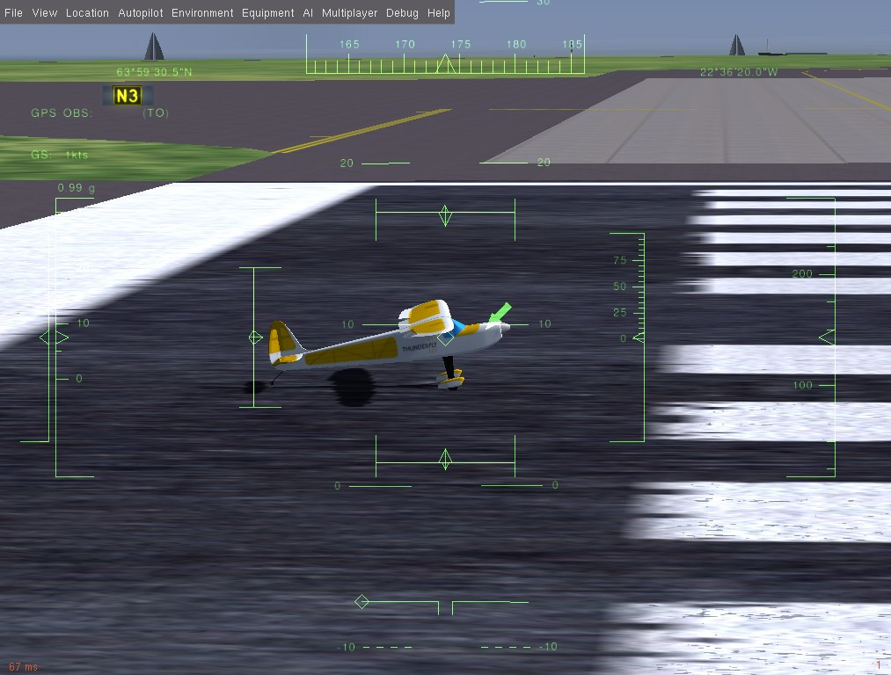

# TF-simulator - Mission Training and Atmospheric Measurement Simulator

The **TF-simulator** is a solution combining atmospheric measurement and flight mission simulation. It bridges two complementary systems:

* **[TF-ATMON](/instruments/TF-ATMON)**: ThunderFly’s toolchain for in-flight atmospheric measurements using UAVs.
* **[PX4-FlightGear-Bridge](https://github.com/ThunderFly-aerospace/PX4-FlightGear-Bridge)**: A simulation environment based on [FlightGear](https://www.flightgear.org/), enabling advanced training and mission rehearsal.

Together, these tools provide both environmental data collection and realistic UAV mission training, suitable for research, education, and operator preparation.


## How TF-simulator Works

The TF-simulator leverages the [PX4-FlightGear-Bridge](https://github.com/ThunderFly-aerospace/PX4-FlightGear-Bridge) to connect the [PX4 autopilot software stack with the FlightGear simulator](https://docs.px4.io/main/en/sim_flightgear/). FlightGear provides:

* Realistic flight dynamics for multiple UAV models (including [TF-G1](https://github.com/ThunderFly-aerospace/TF-G1) and [TF-G2](/instruments/TF-G2) autogyros).
* Advanced weather and environment simulations.
* Support for training missions in diverse conditions.

Meanwhile, [TF-ATMON](https://github.com/ThunderFly-aerospace/TF-ATMON) complements this environment by offering sensor integration and payload data handling, making the simulator not just a training tool but also a platform for testing measurement workflows.

## Vendor Information

The TF-simulator, including professional support, is provided by [ThunderFly s.r.o.](https://www.thunderfly.cz/). For inquiries, training, or paid support options, contact: **[sale@thunderfly.cz](mailto:sale@thunderfly.cz)**

## Key Features

* **Mission rehearsal**: Test complex UAV flight plans in a safe environment.
* **Sensor simulation**: Integrate TF-ATMON-compatible payloads for realistic workflows.
* **Environmental modeling**: Use FlightGear’s advanced weather scenarios.
* **Model library**: Support for autogyros, airplanes, and rovers.
* **Open ecosystem**: Based on open-source PX4 and FlightGear projects.

## Supported UAV Models

| Vehicle                                                           | Description                      |
| ----------------------------------------------------------------- | -------------------------------- |
| [TF-G1](https://github.com/ThunderFly-aerospace/FlightGear-TF-G1) | Autogyro UAV simulation          |
| [TF-G2](/instruments/TF-G2)                                       | Advanced autogyro UAV simulation |
| [TF-R1](https://github.com/ThunderFly-aerospace/TF-R1)            | UAV Ground-station rover model               |
| Rascal airplane                                                   | Fixed-wing simulation            |

## Support and Services

ThunderFly provides paid support for:

* Simulator setup and customization.
* Integration of new UAV models (defined in [YASim](https://wiki.flightgear.org/YASim)).
* Mission training packages.
* Research collaborations.

Contact ThunderFly for tailored solutions at [info@thunderfly.cz](mailto:info@thunderfly.cz).

## Technical Information

The TF-simulator builds directly on the [PX4-FlightGear-Bridge](https://github.com/ThunderFly-aerospace/PX4-FlightGear-Bridge) and is compatible with the PX4 SITL framework. Below are technical details for setup and operation (see the [PX4 documentation](https://docs.px4.io/main/en/sim_flightgear/) for a more complete reference).

### Installation (Ubuntu Linux)

1. Install the PX4 development environment ([PX4 guide](https://docs.px4.io/main/en/dev_setup/dev_env_linux_ubuntu.html)).
2. Install FlightGear via PPA:
   ```sh
   sudo add-apt-repository ppa:saiarcot895/flightgear
   sudo apt update
   sudo apt install flightgear
   ```
3. Set write permissions for the FlightGear Protocols folder:
   ```sh
   sudo chmod a+w /usr/share/games/flightgear/Protocol
   ```

### Running a Simulation

[](https://www.youtube.com/watch?v=iqdcN5Gj4wI)

From the PX4-Autopilot directory, build and run PX4 SITL with the desired vehicle target:

```sh
cd /path/to/PX4-Autopilot
make px4_sitl_nolockstep flightgear_rascal   # Standard plane
make px4_sitl_nolockstep flightgear_tf-g1    # TF-G1 autogyro
make px4_sitl_nolockstep flightgear_tf-g2    # TF-G2 autogyro
make px4_sitl_nolockstep flightgear_tf-r1    # TF-R1 rover
```

_QGroundControl_ will automatically connect to the simulated vehicle.

### Taking it to the Sky


Once PX4 SITL and FlightGear are running and connected, the vehicle will be ready after initialization. In the PX4 console, wait until you see messages about GPS fusion starting. At this point, you can arm the vehicle and take off:


```sh
pxh> commander takeoff
```

You should see the simulated UAV (or rover/plane) become active in the FlightGear window. Use **Ctrl+V** in FlightGear to change the camera view.




### Configuration Options

- `FG_BINARY` – Path to the FlightGear binary (can be AppImage).
- `FG_MODELS_DIR` – Path to additional aircraft model directory.
- `FG_ARGS_EX` – Extra FlightGear runtime arguments.

Examples:
- Start simulation at Honolulu airport:
  ```sh
  FG_ARGS_EX="--airport=PHNL" make px4_sitl_nolockstep flightgear_rascal
  ```
- Show frame rate in FlightGear: **View > View Options > Show frame rate**

### Extending Simulation

Custom UAVs can be added by:
1. Placing aircraft models into the `models` directory.
2. Creating a `.json` configuration file for each model.
3. Adding the model into PX4 build system (`sitl_target.cmake`).

Further development and customization are possible via the [PX4-FlightGear-Bridge source code](https://github.com/ThunderFly-aerospace/PX4-FlightGear-Bridge).


