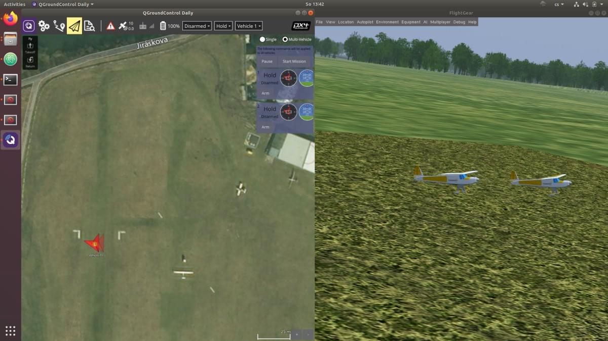

# Multi-Vehicle Simulation

This page explains how to simulate multiple vehicles using TF-Simulator in PX4 SITL. All vehicle instances have parameters defined by their startup scripts.

## Start Multiple Instances

To start multiple instances (on separate ports and IDs):

1. Checkout the [PX4 branch that supports multiple vehicles](https://github.com/ThunderFly-aerospace/PX4Firmware/tree/flightgear-multi):

   ```sh
   git clone https://github.com/ThunderFly-aerospace/PX4Firmware.git
   cd PX4Firmware
   git checkout flightgear-multi
   ```

1. Build the PX4 Firmware using the standard toolchain (with FlightGear installed).
1. Start the first instance using the [predefined scripts](https://github.com/ThunderFly-aerospace/PX4-FlightGear-Bridge/tree/master/scripts):

   ```sh
   cd ./Tools/flightgear_bridge/scripts
   ./vehicle1.sh
   ```

1. Start subsequent instances using another script:

   ```sh
   ./vehicle2.sh
   ```

Each instance should have its own startup script, which can represent a completely different vehicle type.
For prepared scripts you should get the following view.



Ground stations such as _QGroundControl_ connect to all instances using the normal UDP port 14550 (all traffic goes to the same port).

The number of simultaneously running instances is limited mainly by computer resources.
FlightGear is a single-thread application, but aerodynamics solvers consume a lot of memory.
Therefore splitting to multiple computers and using a [multiplayer server](https://wiki.flightgear.org/Howto:Multiplayer) is the way how to run _many_ vehicle instances.

